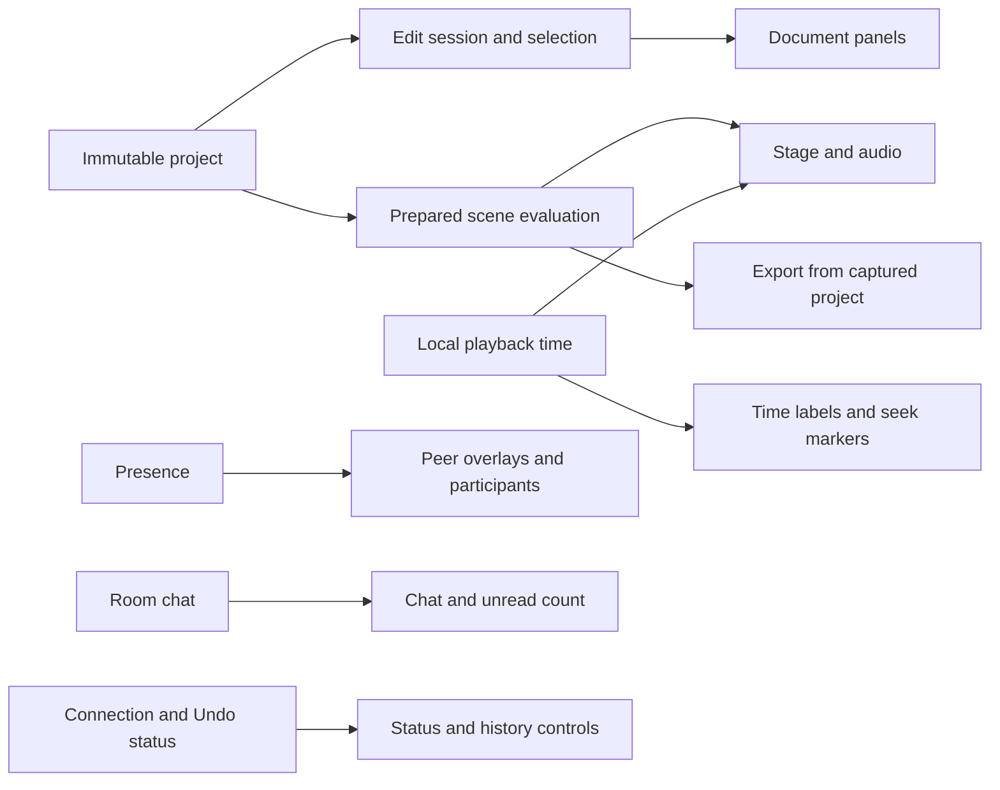

# Poietra

**Make motion together, with friends and AI.**

Poietra is a collaborative motion editor that runs in the browser. Arrange shapes,
text, equations, images and video; animate their properties; mix audio; and export
MP4 or WebM. Friends and the AI assistant edit the same structured objects, so
individual positions, colors and timings remain editable.

[Open Poietra](https://poietra.com) · [日本語の使い方・設定](apps/studio/README.md) ·
[Run locally](#run-locally) · [Architecture](#how-it-is-built) ·
[Performance](#performance) · [Issues](https://github.com/Poietra/poietra/issues)


This repository contains the **MoonBit implementation** of
[poietra-hackathon](https://github.com/Poietra/poietra-hackathon). Application logic
runs as MoonBit-generated JavaScript, with a WebAssembly motion kernel and native
adapters for browser APIs and JavaScript libraries. Executable application TS/TSX
has been removed; internal refactoring and performance work continue.

Documentation reviewed **2026-09-21**, against application revision
[`0cda0c5`](https://github.com/Poietra/poietra/commit/0cda0c5382fb33e7468aa81a06bffc10607e10d2).
The MoonBit service was last verified in production on **2026-09-20**;
see [deployment status and operations](#deployment-and-limits).

## What you can make

- Share a room link and edit together, with presence, offline reconnection and
  Undo scoped to your own edits. Guests can create and edit projects.
- Compose circles, rectangles, text, LaTeX, Bézier paths, arrows, number lines,
  images and video. Align, group or parent objects and edit their anchors.
- Animate properties with separate start times, durations and easing. Add actual
  intermediate values for returns, pauses and color changes; use Move, Write,
  Fade, Grow or Cut, including custom Bézier easing.
- Import and trim audio/video, adjust volume and export the project or a Scene.
  Save a portable project file containing its media.
- Ask `@codex` in shared chat for structured edits or generated image assets.
  Apply a proposal manually, or send with Ctrl/⌘+Enter to apply after validation.
- Optionally sign in with Google or GitHub to keep a private list of project
  shortcuts. Search by name, sort the list and undo its most recent removal.
  Shared-link editing remains available without login.

The [studio guide](apps/studio/README.md) covers editing, accounts, media,
shortcuts, AI configuration and export. Desktop Chromium is the primary tested
browser; codec support depends on the browser and device.

## Run locally

Use Node.js **24+** (tested: 24.13.0), pnpm **10.23.0**, Python **3.12+** for
adapter generation, and the compiler pinned in [.moon-version](.moon-version)
(`moonc v0.10.13+cbb11c36f`). The following commands use a POSIX shell.

```sh
git clone https://github.com/Poietra/poietra.git
cd poietra
pnpm install --frozen-lockfile

curl -fsSL https://cli.moonbitlang.com/install/unix.sh -o /tmp/install-moonbit.sh
bash /tmp/install-moonbit.sh "$(cat .moon-version)"
export PATH="$HOME/.moon/bin:$PATH"
node scripts/moon.mjs update

pnpm dev
```

Open **http://localhost:5173**. The homepage opens a new project or an editable
sample; viewing it alone does not create a room or load the editor. Node stores
local data in `apps/studio/.data`. Editing, collaboration, ordinary chat and export
work without an API key. Optional AI/OAuth settings go in `apps/studio/.env`;
see [configuration](apps/studio/README.md#設定).

Run these commands from the **repository root**:

| Command | Purpose |
| --- | --- |
| `pnpm dev` | Build MoonBit and start the Node/Vite development host on port 5173 |
| `pnpm build:moonbit` | Regenerate adapters and facades; build release JS and motion WASM |
| `pnpm build` | Build MoonBit, check types, bundle the editor and prerender EN/JA HTML/Markdown |
| `pnpm --dir apps/studio start` | Serve the completed production build with Node |
| `pnpm test` | Audit sources, build, run extension/API build tests and Vitest |
| `pnpm typecheck` | Check declarations and captured public API contracts |
| `pnpm audit:source` | Report source inventory and reject executable application TS/TSX |

After editing `.mbt`, run `pnpm build:moonbit`: Vite does not compile MoonBit.
Restart the Node host after server-side changes. The wrapper
`node scripts/moon.mjs` selects `POIETRA_MOON`, then `.tools/moon/bin/moon`, then
`moon` on PATH. Use it for `update`, `check`, `test` and `version --all` so local
commands use the same toolchain as the build.

## How it is built

The [MoonBit packages](moonbit/) hold application behavior.
[apps/studio/](apps/studio/) holds native facades, styles, assets and integration
tests. The pure editing/evaluation core is independent of React and host APIs.

| Layer | Main packages | Responsibility |
| --- | --- | --- |
| Model and engine | `scene`, `motion`, `geometry`, `render`, `audio`, `exporting`, `editor`, `proposal_plan` | Typed documents, edit plans, prepared evaluation, geometry and audio mixing |
| Collaboration | `collaboration`, `boundary`, `browser_editor`, `browser_undo`, `browser_chat` | Yjs leaf edits, immutable snapshots, selective Undo and shared chat |
| Browser | `ui`, `browser_render`, `browser_media`, `browser_export`, `browser_projects`, `browser_kernel` | React UI, drawing, resource lifetimes, decoding, export and portable files |
| Services | `schemas`, `proposals`, `ai_service`, `auth_policy`, `auth_service` | Input validation, guarded AI proposals, OAuth and private project lists |
| Hosts and storage | `node_*`, `worker_*`, `room_assets`, `r2_upload`, `http_policy`, `http_runtime` | HTTP/WebSockets, persistence, quotas and atomic media publication |
| Public site | `site`, `site_shell`, `site_boundary`, `browser_site`, `site_build` | Localized content, lazy editor entry and prerendering |
| Browser linking | `client_runtime` | Generated shared entry for six browser packages |

### Document and collaboration contracts

| Concept | Scope |
| --- | --- |
| Project | Ordered Scenes; portable saves include media, excluding account data and chat |
| Scene | Canvas, object identities, parent links and independent audio tracks |
| Composition | A still state, its hold duration and each object's independent appearance/transform |
| Transition | Animation between adjacent Compositions, with object and property timing |
| Account | Private sessions and room shortcuts, separate from room editing access |

Parent transforms compose as affine matrices. Reparenting preserves geometry in
all Compositions, including retained states; anchor edits compensate position in
the edited state. Sparse shear preserves rotated, nonuniform scales. Evaluated
world matrices are runtime data.
Visibility, opacity, paint order and selection groups remain independent of
parenting. Intermediate keyframes hold actual values at normalized times within
a property's interval, with Composition-linked endpoints and outgoing-segment
easing. Reparenting preserves Composition poses; intermediate keys and paths stay
in parent coordinates and may need adjustment. These features use document
version 2; version 1 files remain readable.

Yjs stores changes at individual fields. Readers receive immutable, structurally
shared snapshots; writers invalidate touched branches before observers run.
Structural deletion and keyframe deletion retain CRDT records. Selective Undo
preserves received peer edits, including dependent parent/point changes, and may
retain a shared creation with a notice. Unreceived offline work cannot be known.
Pending Yjs dependencies are persisted even before they affect the visible view.

[Product rules](apps/studio/AGENTS.md) define these contracts, and
[root implementation rules](AGENTS.md) describe the editing boundaries to preserve.

### UI, rendering and resource ownership



Playback preparation resolves segments, tracks, hierarchy, layer order and curves
once; repeated evaluation uses the shared engine for preview and export. Editing
reads the current Composition. Static holds without visible video can reuse a
prepared frame while export still encodes every timestamp.

Document panels, presence, chat and the local clock have separate subscriptions.
Scene tabs, layers, timeline structure and media rows retain presentation inputs
when their displayed fields stay unchanged. Resource preparation depends on text
across Compositions and visible image assets, so pose/timing edits reuse resources.
A failed preparation can be retried without changing the document.

One typed render view drives serialized SVG and retained stage nodes. Opaque
shapes without effects use cached native geometry for direct Canvas painting;
opacity and Glow retain isolated compositing. Sequential video decoding keeps
owned pixel surfaces and resets on seeking. Async owners suppress stale results,
release resources on cancellation and preserve encoder/upload backpressure.

### Build and host boundaries

`pnpm build:moonbit` produces release modules under `_build/` and copies the motion
WASM into `apps/studio/public/wasm/`. Generated code has three sources of truth:

| Source | Generated output |
| --- | --- |
| [scene model](moonbit/scene/model.mbt) via [generate-adapters.py](scripts/generate-adapters.py) | JS marshalling and public [scene types](apps/studio/shared/scene-types.d.ts) |
| [bindings.json](scripts/bindings.json) | Simple native JS facades forwarding public calls |
| Package `moon.pkg` exports via [client-runtime.mjs](scripts/client-runtime.mjs) | Shared browser entry/export tables |

The browser links `boundary`, `browser_editor`, `browser_media`, `browser_render`,
`browser_undo` and `ui` once through `client_runtime`. The
[Vite adapter](apps/studio/scripts/moonbit-client.mjs) redirects browser imports
and rejects duplicate standalone copies. Node, Worker and SSR use standalone
artifacts. The homepage, file/export operations, MathJax and Mediabunny retain
separate or lazy loading. Do not edit generated tables or duplicate domain records.

The [MoonBit dependency pins](moon.mod) include mizchi's JS bindings **0.13.0**,
`npm_typed` **0.1.16** for React/Zod and `cloudflare` **0.1.12** for selected
SQLite/R2 bindings. React/Base UI, Yjs, MathJax, Mediabunny and the OpenAI SDK remain
JavaScript runtime dependencies. Native adapters connect those APIs to MoonBit;
package versions are pinned in [package.json](apps/studio/package.json) and
[pnpm-lock.yaml](pnpm-lock.yaml).

### What the remaining TypeScript represents

Source audit rerun **2026-09-21**, including personal project search and recovery:

| Source purpose | Files | Physical lines |
| --- | ---: | ---: |
| MoonBit application | 282 | 57,271 |
| Native JS runtime adapters | 112 | 783 |
| Executable application TS/TSX (`src/shared/server/worker`) | 0 | 0 |
| TypeScript tests, fixtures and test configurations | 147 | 16,505 |
| Public/environment type declarations | 113 | 1,934 |
| TypeScript benchmark/tool configuration | 5 | 140 |

These counts include generated code, comments and blanks; they exclude external
library implementations and do not measure delivered bytes. Use `pnpm audit:source`
or `node scripts/source-inventory.mjs --json` for the full inventory, including
MoonBit tests and JS tooling. CI rejects executable TS/TSX in the four application
directories. Historical comparison implementations are available in Git and
[poietra-hackathon](https://github.com/Poietra/poietra-hackathon).

Internal refactoring remains: [media editing commands](moonbit/browser_editor/media_commands.mbt)
still merge native patches before validation, and some UI/host orchestration uses
`Any`. Document Context adapters still observe edits even when panel content is
reused. Further work is to move domain decisions into typed plans, narrow those
subscriptions and reduce the still-large editor entry. Zero executable TS is an
inventory result, not completion of these changes.

## Add a feature

1. Define domain data in `moonbit/scene/model.mbt` and kinds in
   `moonbit/scene/kinds.mbt`. Put pure edit decisions in `editor` and shared
   evaluation in `scene`/`motion`; keep React, Yjs and platform objects at the host
   boundary. Read the applicable [implementation](AGENTS.md) and
   [product rules](apps/studio/AGENTS.md).
2. Implement validation, persistence compatibility, commands, evaluation,
   rendering and UI as needed. Generated record types do not implement these
   behaviors. Object creation, clipboard and media imports share
   `editor.ObjectInsertion`; Scene/Composition defaults use `scene/creation`, with
   limits and creation decisions in `editor/structure_commands`.
3. Preserve collaboration intent. Property channels share enumeration/lookup in
   `scene/editing`; typed plans identify changed leaves. Retain existing Yjs
   timing parents. Validate all targets and encode detached values before any
   write: a Yjs transaction cannot roll back earlier writes when conversion fails.
4. Export host-facing functions in the package's `moon.pkg`, with a precise
   adjacent `.d.ts` contract and a `scripts/bindings.json` entry for direct
   forwarding. Run `pnpm build:moonbit` to regenerate adapters/facades/shared
   exports. Check existing mizchi bindings before adding a native API boundary.
5. Run `pnpm test`, `pnpm typecheck`, pure-core tests on JS/WASM, and the
   [relevant browser/runtime checks](#checks). Verify preview/export agreement,
   offline edits and selective Undo for changes that affect those behaviors.

`pnpm test:extensions` adds a nested optional record and callable API in an
isolated copy, regenerates and compiles them, checks standalone/shared-runtime
calls and rejects incorrect TypeScript consumer fields. The contract gate checks
108 captured public modules while allowing new exports; shared-runtime tests
compare 219 function exports and their arity.

## Checks

The last application revision, `0cda0c5`, passed
[CI run 35499218054](https://github.com/Poietra/poietra/actions/runs/35499218054):
700 Vitest checks, five build/API checks, 48 MoonBit JS tests, 41 WASM tests,
170 main browser checks, eight export checks, six media checks and 26 production
page checks, plus actual Node/workerd persistence, hibernation, restart, R2 and
account/TTL integrations. [.github/workflows/check.yml](.github/workflows/check.yml)
is the authoritative selection; these counts describe that run.

The broader local development suite passed all 180 checks on frozen sources.
An earlier 178/180 run overlapped a Vite restart while the build plugin was being
edited; the complete suite was rerun after freezing the configuration.

```sh
# Repository root
pnpm test
pnpm typecheck
node scripts/moon.mjs check --target js --deny-warn
node scripts/moon.mjs test --target js
node scripts/moon.mjs test --target wasm moonbit/motion moonbit/proposal_plan moonbit/editor moonbit/scene
pnpm build

# apps/studio
cd apps/studio
pnpm exec playwright install chromium
pnpm test:e2e
pnpm test:export
pnpm exec playwright test --config tests/e2e/media-export.config.ts
pnpm exec playwright test --config tests/e2e/site-production.config.ts
node tests/collaboration-worker.integration.mjs --port 8796
node tests/media-storage.integration.mjs node
node tests/r2-assets-worker.integration.mjs
node tests/accounts-worker.integration.mjs
```

Video checks require FFmpeg/ffprobe. On Linux, Playwright may also need browser
system dependencies (`pnpm exec playwright install --with-deps chromium`).
Use an isolated local test host: browser tests create and edit rooms. The default
E2E configuration uses port 5173 and may reuse an existing server; set
`POIETRA_TEST_URL` to a dedicated host if that port belongs to your development
session. The production-page configuration serves the completed build separately.

Automated provider HTTP is simulated. Production smoke verified GitHub's
authorization redirect and flow storage; full Google/GitHub login completion and
paid OpenAI calls were not part of this release's verification.

## Performance

Measurements are stored in [benchmarks/](benchmarks/) with source/artifact hashes,
environment, workloads and raw samples. The following results describe specific
local fixtures. Production CDN delivery, real mobile hardware, WAN collaboration
and long source-media projects need separate measurement.

### Shared browser linking — 2026-09-20

Application `0cda0c5` links the six browser packages once. Its baseline is
`2c00643` (application `99a349d`); standalone boundary/editor and WASM artifacts
remained identical. [Bundle before](benchmarks/2026-09-20-client-linking/bundle-before.json)
and [after](benchmarks/2026-09-20-client-linking/bundle-after.json) record all files
and hashes.

| Static JS group | Before | After |
| --- | ---: | ---: |
| Editor, raw | 1,883,417 B | 1,610,705 B (−14.5%) |
| Editor, gzip level 9 | 524,141 B | 457,443 B (−12.7%) |
| Editor, Brotli | 401,036 B | 371,942 B (−7.3%) |
| Homepage, gzip level 9 | 91,072 B | 91,134 B (+62 B) |

Groups include static imports; the homepage also includes its selected entry.
Dynamic editor modules, CSS, fonts and media are excluded. Compression is computed
per file, using Node's default Brotli settings, rather than measured on the wire.

Cold startup used three fresh contexts per build, no warmup, one pre-seeded
circle, a 412 × 823 viewport, disabled cache, 4× CPU slowdown, 150 ms HTTP latency,
200,000 B/s download and 93,750 B/s upload. Hardware: Core Ultra 7 255H, 32 GiB,
WSL2, CPUs 0–15; Node 24.13.0, MoonBit 0.10.13+cbb11c36f and Chromium 153.0.8010.12.
Runs were sequential with frozen artifacts and no concurrent local builds,
tests or encoders.

| Cold startup, median [min–max] | Before | After |
| --- | ---: | ---: |
| FCP | 1,680 [1,668–1,684] ms | 1,676 [1,668–1,676] ms |
| LCP | 11,340 [11,288–11,376] ms | 10,152 [10,148–10,172] ms |
| Circle in DOM + two animation frames | 11,903.9 [11,811.2–11,963.9] ms | 10,651.2 [10,648.7–10,651.7] ms |
| Observed long-task blocking sum | 354 [304–476] ms | 347 [338–354] ms |

Stage readiness improved **10.5%** in this fixture. The local Node server sends
uncompressed assets and uses local WebSockets; these are not production load
times. The stage metric is a presentation opportunity, not physical display or a
Web Vital, and the blocking sum is not Lighthouse TBT. Full samples:
[startup before](benchmarks/2026-09-20-client-linking/startup-before.json),
[startup after](benchmarks/2026-09-20-client-linking/startup-after.json).

A separate warm interaction run used 100/500 circles at 1440 × 900, one drag
warmup and three sets of 60 pointer moves, with a 1 ms CPU sampler. For 500 circles,
median delivery-to-DOM was **14.4 ms**, delivery-to-DOM plus two animation frames
was **33.4 ms**, and actual input spacing was **50.0 ms**. The three-second Scene
(two one-second holds and one-second transition) had rAF intervals of 16.7 ms
median, 49.9 ms p95 and 83.4 ms maximum. Long frames remain. This final run does
not establish an interaction speedup; it excludes pre-delivery input waiting,
media, WAN and hardware GPU behavior. [Samples and profiles](benchmarks/2026-09-20-client-linking/)
retain the full observations.

### Earlier measurement evidence

These datasets belong to earlier revisions; do not combine their speedups or
report them as fresh measurements of the current release. Previous explanations,
including unsuccessful/intermediate runs and old deployment records, remain in
[the README at 5468c56](https://github.com/Poietra/poietra/blob/5468c56/README.md#performance).

| Investigation | Retained evidence |
| --- | --- |
| Panel/resource invalidation | [Document updates](benchmarks/2026-09-20-document-updates/) |
| Clock, presence and chat subscriptions | [UI subscriptions](benchmarks/2026-09-20-ui-subscriptions/), including synchronous-clock regressions |
| Retained SVG and direct Canvas shapes | [Rendering, interaction, startup and WebCodecs](benchmarks/2026-09-20-retained-rendering/) |
| Parenting and value curves | [Primitives](benchmarks/2026-09-20-primitives/) |
| Lazy loading, static holds and export | [Startup](benchmarks/2026-09-20-startup/) and [interaction/export](benchmarks/2026-09-20-interaction/) |
| Typed editing plans | [Object edits](benchmarks/2026-09-20-editing/), [Transition timing](benchmarks/2026-09-20-timing/), [track timing](benchmarks/2026-09-20-tracks/) and [creation](benchmarks/2026-09-20-creation/) |
| Initial migration and video pipeline | [2026-09-19](benchmarks/2026-09-19/) and [optimized](benchmarks/2026-09-19-optimized/) |

The latest recorded export timing comparison is the retained-rendering experiment
(`4b2ae74` → `8357a35`). Its warmed 500-shape MP4 fixture, 90 frames at 720p/30 fps,
fell from **387.7 [382.5–395.2] ms to 342.0 [336.6–342.6] ms** (median [min–max]).
It used one warmup and three measured runs, fresh painter/encoder resources,
Chromium/SwiftShader on the same WSL2 machine with CPUs 0–15, and CDP profiling.
Other host activity was not isolated. It excludes source audio/video, module
loading and download handling; every
output's packet count and first decoded frame were checked. This is an engine
fixture, not a prediction for a user's video. See [export before](benchmarks/2026-09-20-retained-rendering/export-before.json)
and [after](benchmarks/2026-09-20-retained-rendering/export-after.json).

### Reproduce the measurements

Build once, then freeze sources and generated artifacts. Run workloads
sequentially, without other builds/tests/encoders. Default outputs go to ignored
`test-results/`; use distinct files for repeated runs. Historical comparisons
require the matching source revision and harness, not just today's scripts.

```sh
# Repository root: current MoonBit CPU suites in three fresh processes each
pnpm build
pnpm bench --runs 3 --output test-results/benchmarks/cpu.json

# Terminal 1, from the repository root: isolated production host
cd apps/studio
PORT=5188 NODE_ENV=production OPENAI_API_KEY= POIETRA_DATA_DIR=/tmp/poietra-perf \
  node server/index.js
```

```sh
# Terminal 2, from apps/studio; run each command to completion
pnpm exec playwright install chromium
POIETRA_PERF_URL=http://127.0.0.1:5188 node scripts/measure-home.mjs
POIETRA_PERF_URL=http://127.0.0.1:5188 node scripts/measure-editor.mjs
POIETRA_PERF_URL=http://127.0.0.1:5188 node scripts/measure-startup.mjs
POIETRA_PERF_URL=http://127.0.0.1:5188 node scripts/measure-interaction.mjs
node scripts/measure-bundle.mjs
```

`POIETRA_PERF_OUTPUT` selects a browser measurement's JSON file.
`measure-home` defaults to five runs per locale, `measure-startup` to three cold
runs (`POIETRA_PERF_RUNS`); `measure-editor` uses 30 inputs per scenario
(`POIETRA_PERF_SAMPLES`). Match affinity explicitly when comparing historical
runs: latest shared-linking results used CPUs 0–15; some earlier experiments used
measurement CPUs 0–3 and server CPUs 4–5.

Renderer/export harnesses import source modules through a **development** host
using the same release MoonBit artifacts. Keep this separate from startup runs:

```sh
# Terminal 1, apps/studio: stop the production measurement host first
PORT=5189 OPENAI_API_KEY= POIETRA_DATA_DIR=/tmp/poietra-render node server/index.js
```

```sh
# Terminal 2, apps/studio
node scripts/benchmark-rendering.mjs --url http://127.0.0.1:5189 --frames 60 \
  --output test-results/benchmarks/rendering-1.json
POIETRA_BENCH_URL=http://127.0.0.1:5189 node scripts/benchmark-export.mjs
POIETRA_PERF_URL=http://127.0.0.1:5189 node scripts/measure-subscriptions.mjs
POIETRA_PERF_URL=http://127.0.0.1:5189 node scripts/measure-document-updates.mjs
```

Rendering video fixtures require FFmpeg/libx264 (`--skip-video` omits them).
Export uses `POIETRA_BENCH_RUNS` and `POIETRA_BENCH_OUTPUT`. Subscription/document
probes count development StrictMode invocations, including retries and diagnostic
overhead; they are not production timing or FPS measurements.

## Deployment and limits

Node persists locally. Cloudflare serves Static Assets, stores room/account state
in SQLite Durable Objects and keeps media bytes in private R2. Default Wrangler
configuration is for isolated `poietra-moonbit` validation. The explicit
`production` environment updates the existing `poietra-hackathon` Worker in
Yumaboda's account, preserving `poietra.com`, old workers.dev links, three Durable
Object namespaces, migration tag `v2-accounts`, secrets and `poietra-assets-prod`.

**Last recorded deployment: 2026-09-20 17:32 JST.** Application `0cda0c5`
served at 100% as Worker version `9d95a13c-c383-4c14-89f5-4af572ab85a4` after CI
passed. All 16 bindings and runtime settings matched the preceding release;
there was no document/storage migration. The recorded predecessor is
`83767c03-c8ae-49bb-8151-194d35af64a3` (application `99a349d`). Confirm the active
version before the next deployment instead of assuming this record is live state.

Verification used a dedicated room: release JS/WASM hashes, existing room/R2
restoration, upload deduplication, two-browser edits and selective Undo,
guest/account UI, GitHub authorization start, playback and seeking. A downloaded
720p MP4 decoded all 102 expected frames. Full provider login and paid AI calls
were outside that smoke check.

Use the [studio deployment procedure](apps/studio/README.md#実行と配置) for local
workerd, version upload, activation and rollback. `pnpm --dir apps/studio run deploy`
only builds a **dry run**. A Worker rollback changes code/assets; it does not
restore room data. Any rollback must understand version 2 documents and persistent
account dismissals.

The [limits table](apps/studio/README.md#現在の制限) covers project structure, media,
keyframes and AI. Long projects, large media workloads and many WAN collaborators
still need performance evaluation; optional provider integrations need live
verification in the target environment.

The rewrite originated from public hackathon commit
`3f49040ee4bcf06bfcf02e269712833f3729c536`. The original
[hackathon application](apps/studio/docs/hackathon-application.md) remains a
historical record. Current behavior belongs in these READMEs and the product
rules; the separate private design archive was not imported.
