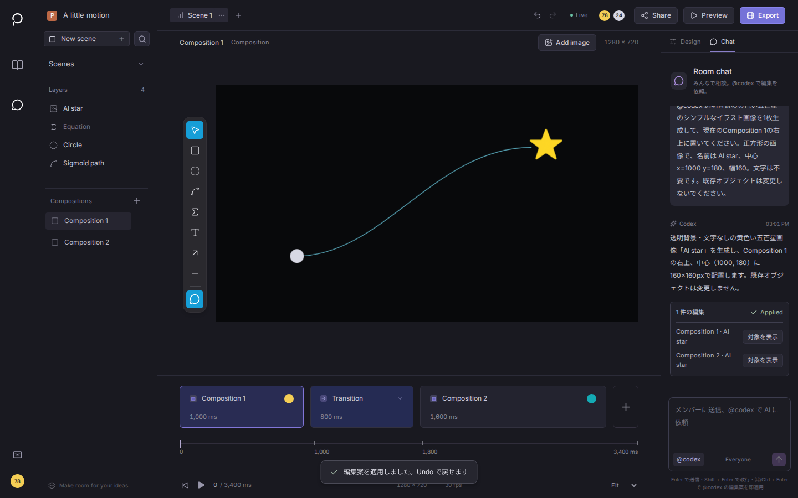
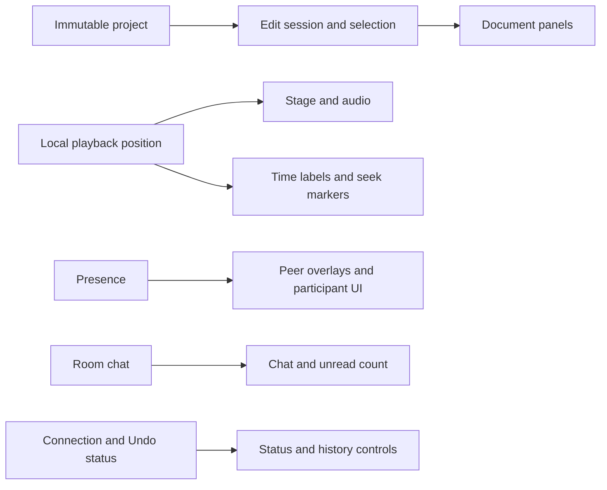

# Poietra

**Make motion together, with friends and AI.**

Poietra is a collaborative motion editor that runs in the browser. Arrange shapes,
text, equations, images and video; animate their properties; mix audio; and export
MP4 or WebM. Everyone edits the same structured project, including the AI assistant.
Its changes remain editable and can be undone.



[日本語の使い方・設定](apps/studio/README.md) · [Performance](#performance) ·
[Checks](#checks) · [Issues](https://github.com/Poietra/poietra/issues)

This is the **MoonBit implementation** of the original
[Poietra hackathon application](https://github.com/Poietra/poietra-hackathon).
Application logic—including the UI, collaboration, rendering, media, AI and
servers—is written in typed MoonBit. The numerical motion kernel targets
WebAssembly; browser and server packages target JavaScript. Native adapters retain
React/Base UI, Yjs, MathJax, Mediabunny, OpenAI and platform APIs.
There are no executable `.ts` or `.tsx` files in `src`, `shared`, `server` or
`worker`. Public `.d.ts` contracts and TypeScript tests/tooling remain; native JS
entry points run without a TypeScript loader.

**The MoonBit implementation is live at [poietra.com](https://poietra.com)**
since 2026-09-20 02:55 JST. It updates the existing service and retains its shared
rooms, media storage and account bindings. See [deployment details](#deployment-and-limits).

## What you can make

- Share a room link and edit together, with presence, offline reconnection and
  Undo scoped to your own edits.
- Compose circles, rectangles, text, LaTeX, Bézier paths, arrows, number lines,
  images and video. Align or group objects, parent them and edit their anchors.
- Set a separate start, duration and easing for position, opacity and other
  properties. Add intermediate actual-value keyframes for returns, pauses and
  color changes. Use Move, Write, Fade, Grow and Cut, including custom Bézier easing.
- Import audio/video, trim clips, adjust volume and preview the same timeline
  used for export. Save a portable project file with its media embedded.
- Ask `@codex` in shared chat for structured edits or generated image assets.
  Apply a proposal manually or send with Ctrl/⌘+Enter to apply after validation.
- Optionally sign in with Google or GitHub to keep a private project list.
  Guest editing through a shared link still works.

A **Scene** owns the canvas and object identities. A **Composition** is a still
state with a hold duration. A **Transition** animates between adjacent
Compositions; changing a state in one Composition does not change another.

### Accounts, collaborators and personal project lists — 2026-09-20

The account model separates these concepts:

| Concept | Meaning and lifetime |
| --- | --- |
| Account | The private identity that holds your project shortcuts across devices. Its stable ID comes from the provider and provider user ID. |
| Login method | Google or GitHub verifies that identity. They currently create separate accounts, even when their email addresses match. Explicit linking is not implemented. |
| Session | An authenticated browser session, valid for seven days. Signing out revokes that session and clears its private list from the screen; other devices' sessions continue. |
| Collaboration display name | A name stored in this browser and shown to participants and in chat. It can be edited independently of the provider's profile name, including while editing as a guest. It is not verified account identity. |
| Personal project shortcut | A private reference to a shared room, with its last observed title and the time the shortcut was refreshed. It does not establish project ownership or describe the room's latest edit time. |
| Shared project / room | The document and shared-link editing space. Anyone with its link can edit, including guests. The account list, sessions and login identities are outside the collaborative document and portable files. |

The logo opens **Projects**, including the account and personal list. The avatar
opens **共同編集の表示名と共有** for the collaboration name and shared link.
Signing in remembers rooms opened while signed in. **一覧に追加済み** shows that
the current room already has a shortcut; file download remains a separate action.
Removing a shortcut retains a private dismissal, so reloads, other devices and
automatic title refreshes cannot recreate it. **このプロジェクトを一覧に追加**
explicitly restores it. Removing it or signing out leaves shared-link editing
available. A failed session lookup is shown as an error with retry, rather than
being reported as a confirmed guest session.

`PUT /api/projects/:room` distinguishes `intent: "visit"` (also the default for
older editors' automatic requests) from `intent: "remember"`. A skipped automatic
visit returns `{ project: null }`; explicit additions report the 500-shortcut limit
without clearing the signed-in list. Node reads the original JSON arrays and
stores typed listed/dismissed entries. The Worker retains the existing `projects`
table and adds `project_dismissals`, updating both atomically. Dismissals store only
room IDs, are private to the account, and do not count toward the visible list limit.
Shared room schemas, account IDs, cookies and Durable Object namespaces stay stable.

### Parenting, anchors and intermediate values — 2026-09-20

The agreed model keeps `parentId` on the Scene object and sparse
`anchorX/anchorY`, `scaleX/scaleY` and `shear` on each Composition state.
`x/y` locate the anchor in the parent's coordinates; geometry dimensions remain
independent. Parent transforms compose as full affine matrices. Shear preserves
geometry when rebasing rotated, nonuniform scales; evaluated `world` matrices
are used by SVG, Canvas, selection and pointer projection, never saved.

**Transform → Parent** reparents or detaches while preserving each Composition's
geometry, including states retained for Undo. **Anchor X/Y** also compensates
position to preserve geometry. Parents contribute transforms; visibility,
opacity, groups and paint order remain independent. Singular parent transforms
are rejected before writing. Missing parents act as roots; concurrent cycles
retain authored links and deterministically ignore the smallest ID's edge.
After a peer edits coordinates or motion using a parent relation, Undo retains
that relation and its compensating transforms, with a notice. Independent
appearance changes still undo. A new parent used by a peer child is retained
like other shared creations; this protects received edits, not unseen offline work.

**Property timing → Keyframes** edits actual numbers or `#RRGGBB` colors.
Endpoints follow adjacent Composition values; intermediate `at` values are
strictly between 0 and 1 within that property's timing interval. Changing its
duration stretches all its points. Easing belongs to the outgoing segment; the
first segment inherits property easing. Explicit curves override the legacy
interpolation of that field, including motion-path coordinates. Cut retains
points but does not evaluate them. Reparenting preserves Composition poses;
intermediate motion paths/keys remain in parent coordinates and may need adjustment.

Keyframes use stable IDs and per-field Yjs changes, including through `setTrack`.
Deletion leaves a tombstone so Undo can preserve peer value edits. Creation Undo
retains a new point after a peer has edited it, without undoing earlier local work. Equal times
retain all records and evaluate the greatest ID. At most 1,024 retained points
fit in a track. Old rooms receive empty containers from their authoritative host;
point editing waits for initial synchronization. New features mark the document
**version 2**, independently of Undo. Version 1 files still load. Collaborators
with an older open editor must reload before using these features.

AI exposes `setParent`, `setAnchor` and `setKeyframe` with guarded application;
it shares the same typed plans/evaluator. Playback sorts points and resolves the
hierarchy once; frame evaluation uses binary search per curve. Enlarged local
rasters use bounded density steps to retain text/curve detail without rebuilding
for every fractional scale change.

## Run locally

Use Node.js **24+** (tested: 24.13.0), pnpm **10.23.0**, Python **3.12+** for
adapter generation, and the exact MoonBit version in [.moon-version](.moon-version)
(`moonc v0.10.13+cbb11c36f`).

```sh
git clone https://github.com/Poietra/poietra.git
cd poietra
pnpm install --frozen-lockfile

curl -fsSL https://cli.moonbitlang.com/install/unix.sh -o /tmp/install-moonbit.sh
bash /tmp/install-moonbit.sh "$(cat .moon-version)"
export PATH="$HOME/.moon/bin:$PATH"
node scripts/moon.mjs update

pnpm dev
```

Open **http://localhost:5173**. Editing, collaboration, media and export work
without an API key. Optional AI/OAuth settings belong in `apps/studio/.env`;
see the [configuration guide](apps/studio/README.md#設定).
The Node host saves data under `apps/studio/.data` by default.

```sh
pnpm build                     # MoonBit JS/WASM, types, Vite, localized HTML/Markdown
pnpm --dir apps/studio start    # serve the production build locally
pnpm test                      # build, extension test, behavioral regression tests
pnpm typecheck
node scripts/moon.mjs check --target js --deny-warn
```

`node scripts/moon.mjs` selects `POIETRA_MOON`, then `.tools/moon/bin/moon`, then
`moon` on PATH. Rebuild with `pnpm build:moonbit` after editing `.mbt` files;
Vite's native source watching does not compile MoonBit.

## How it is built

| Layer | MoonBit packages | Responsibility |
| --- | --- | --- |
| Pure model and engine | `scene`, `motion`, `geometry`, `render`, `audio`, `exporting`, `editor`, `proposal_plan` | Typed documents, prepared playback, geometry, SVG, PCM mixing, edit/export plans |
| Collaboration | `collaboration`, `boundary`, `browser_editor`, `browser_undo`, `browser_chat` | Field-level Yjs edits, immutable snapshots, selective Undo and chat |
| Browser | `ui`, `browser_render`, `browser_media`, `browser_export`, `browser_projects`, `browser_kernel` | React components, resource ownership, Canvas/WebGL2, decoding, export and file transfer |
| Services | `schemas`, `proposals`, `ai_service`, `auth_policy`, `auth_service` | Validated AI operations, bounded requests, OAuth and private project indexes |
| Hosts and storage | `node_server`, `node_rooms`, `node_assets`, `node_auth`, `worker_server`, `worker_room`, `worker_assets`, `worker_accounts`, `room_assets`, `r2_upload`, `http_policy`, `http_runtime` | HTTP/WebSockets, persistence, quotas, streaming uploads and atomic publication |
| Public site | `site`, `site_shell`, `site_boundary`, `browser_site`, `site_build` | English/Japanese content, lazy editor entry, prerendering and content negotiation |

The implementation lives in [moonbit/](moonbit/). [apps/studio/](apps/studio/)
contains native adapters, styles, assets and regression tests. Generated release
modules go to `_build/`; `scripts/generate-adapters.py` generates representation
adapters and public record types from the typed model. `scripts/bindings.json`
generates 32 simple JS facades. Wrangler environment types are generated under
ignored `.wrangler/`, rather than committed as 15,408 lines of application source.
Historical source is available in
[poietra-hackathon](https://github.com/Poietra/poietra-hackathon) and Git history.
Copied TypeScript/Rust implementations were removed on 2026-09-20.

The rewrite changes the data flow as well as the language:

- **Prepare once, evaluate repeatedly.** Typed `Hold`/`Change` programs resolve
  tracks, object matches, layer order and colors before playback. Seeking uses a
  binary search. Preview and export share the evaluator.
- **Share unchanged data.** Yjs reads reuse immutable branches and invalidate
  touched branches before observers run. Presence/chat updates retain unchanged
  Scene identities; a one-field proposal reads only the state it needs.
- **Subscribe at the point of use.** `StudioPosition` owns the browser-local
  playback time. Stage evaluation, audio and time indicators subscribe directly;
  the document/selection Context does not carry clock notifications. Store
  projections isolate project, connection/history and presence consumers, while
  chat and its read marker stay in the aside. Public `useEditor` still supplies
  a complete live view for consumers that request it.
  A dedicated clock provider publishes one consistent React Context snapshot
  using ordinary state updates, allowing pending ticks to yield to input. Shared
  document subscriptions continue to use `useSyncExternalStore`.
- **Own asynchronous work.** Renderers, decoders, imports and AI requests have
  explicit lifetimes. Stale completions cannot publish into a replacement view;
  cancellation releases resources. Uploads use bounded buffers and backpressure.
- **Keep video frames as pixels.** A bounded decoder cursor follows actual
  source timestamps, including variable frame intervals. Canvas painting bypasses
  PNG/SVG conversion; shared-source objects retain independent owned frames.
  Seeking resets the cursor and GPU failure retains the portable SVG path.
  Media parsers/codecs load on demand, outside the editor's static entry graph.
  This uses Mediabunny 1.56.2's
  [sequential canvas iterator](https://mediabunny.dev/guide/reading-media-files),
  with explicit ownership and cancellation around the host binding.
- **Retain rendered objects.** One typed SVG view drives both serialized output
  and keyed stage elements. Moving or recoloring a shape keeps its geometry DOM;
  changed geometry replaces only that object's content. The Canvas painter draws
  opaque shapes without effects directly with cached Path2D geometry. Opacity and
  Glow retain isolated compositing, with the same evaluator and transforms for
  preview and export.
- **Plan typed edits.** Manual creation, clipboard and media imports share an
  `ObjectInsertion` plan. Drag/hide eligibility and animation selection use typed
  values in `editor`, which is checked on both JS and WASM. Adapters read only
  the needed metadata and encode complete batches before any Yjs write. Group
  expansion uses sets; drag plans encode coordinate leaves directly. Transition
  resizing reads only time ranges and emits changed leaves; property timing uses
  typed insert/clear/keep/update variants while retaining existing Yjs parents.
  Single-track timing distinguishes missing, automatic and explicit tracks with
  an enum and validates the whole candidate before planning its changes.
  Scene/Composition creation shares typed factories with sample documents and
  copy/delete operations. Creation checks limits, resolves every shared parent
  and encodes detached maps before publishing one captured local transaction.
- **Preserve edit intent.** Commands write only changed fields. Guarded proposals
  validate the complete batch before publication. Pending Yjs dependencies are
  persisted even when they have not yet produced a visible document change.

Upstream packages were selected by source review and compatibility tests:
[mizchi/js.mbt](https://github.com/mizchi/js.mbt) **0.13.0** supplies host bindings;
[mizchi/npm_typed.mbt](https://github.com/mizchi/npm_typed.mbt) **0.1.16** supplies
React/Zod bindings; [mizchi/cloudflare.mbt](https://github.com/mizchi/cloudflare.mbt/tree/575da27df27e0342813143ed17cce470960fbf73)
**0.1.12** supplies selected SQLite and R2 types. Native Promise bindings bridge
R2 into the application's request lifetimes, and alarm timestamps use `Double`.

Other reviewed libraries—including Luna, gfx, converge, audio-mbt and MoonBit
OpenAI clients—are not dependencies. Yjs retains the nested-map/selective-Undo
contract; the official OpenAI SDK retains Responses and Images support. The
[gfx source](https://github.com/mizchi/gfx-mbt/tree/1aec97a83ab1e7d0c924c400f0e5494f8ac3c1ca)
informed the separation between the pure Glow program and its browser driver.

### What the remaining TypeScript represents

Audited 2026-09-20 at application revision `fa0b627`, after removing the historical implementations.
GitHub's [language percentages count source bytes](https://github.com/github-linguist/linguist/blob/main/docs/how-linguist-works.md),
including test code; they do not measure how much application logic remains to
port. The working-tree inventory separates the remaining TypeScript by purpose:

| TypeScript purpose | Files | Physical lines |
| --- | ---: | ---: |
| Executable application code (`src/shared/server/worker`) | 0 | 0 |
| Regression/browser tests, fixtures and test configurations | 147 | 16,256 |
| API/environment declarations (`.d.ts` / `.d.mts`), erased at runtime | 112 | 1,932 |
| Benchmark scripts and root tool configurations | 5 | 139 |

The same inventory has **56,448 application MoonBit lines** and **783 native JS
adapter lines**. This includes generated adapters, comments and blanks; it is
neither a runtime payload measurement nor a count of external library code.
React/Base UI, Yjs, MathJax, Mediabunny and the OpenAI SDK still provide JavaScript
runtime behavior through host bindings. Replacing those libraries is a separate
implementation and compatibility task; it cannot be inferred from the TS ratio.

Internal refactoring remains. [Audio/video commands](moonbit/browser_editor/media_commands.mbt)
still merge native patches before validation. Parts of the UI and host
orchestration also use `Any`. Move remaining domain decisions into typed plans;
React/DOM, Yjs and platform object interactions belong in host bindings. The
zero-TS count is an inventory result, not completion of this internal refactoring.

The architecture review on 2026-09-20 used mizchi's `moonbit-practice`,
`frontend-review-state` and `frontend-review-performance` guidance: typed ownership and measured hot paths
are the criteria, rather than language percentages. The pure editing/evaluation
core and immutable collaboration boundary are separated. UI subscriptions now
follow their update frequency and owner:



Prepared playback belongs to the stage view; finding the current segment and
transition-local time derives from the document and current clock rather than
storing a second synchronized copy. Stable holds retain their Stage component.
New UI features should select a document field, presence, chat or local time
explicitly; ordinary property panels should not use the aggregate `useEditor`
compatibility hook. No document schema or collaboration semantics changed.

Remaining work includes resource preparation keyed to resource changes, finer
subscriptions within document edits, initial editor delivery and remaining `Any`
orchestration. This is a narrower update boundary, not a claim that all UI work
or startup costs have been removed.

Run `pnpm audit:source` to reproduce the inventory, or
`node scripts/source-inventory.mjs --json` for raw byte/line counts. The audit also
fails if executable TS/TSX returns to the four application directories, and runs
as part of `pnpm test` in CI. Behavioral tests and precise public declarations
protect current functionality and extension contracts. CPU benchmarks run directly
with Node 24's built-in type stripping; `tsx` is no longer in the dependency tree.

## Add a feature

1. Define data and behavior in the appropriate typed MoonBit package. Document
   fields belong in `moonbit/scene/model.mbt`; kind variants and names belong in
   `moonbit/scene/kinds.mbt`. `pnpm build:moonbit` regenerates JS marshalling and
   `apps/studio/shared/scene-types.d.ts`. Unknown representations fail generation.
2. Implement validation, commands, evaluation/rendering and UI where the feature
   needs them. A generated record does not automatically gain UI, persistence
   validation or animation semantics. Use compiler errors and regression tests
   to find affected constructors and exhaustive matches; keep old files readable.
   Property channels share enumeration, lookup and replacement in `scene/editing`;
   `editor` timing plans describe changed leaves without host types. Verify new
   channel behavior on both JS and WASM and preserve existing Yjs parent identity.
   Scene/Composition defaults live in `scene/creation`; creation decisions and
   capacity checks live in `editor/structure_commands`. Prepare host values and
   validate their parents before publication; a Yjs transaction cannot roll back
   earlier writes when a later conversion throws.
3. Export host-facing operations in the package's `moon.pkg`. Add a precise
   adjacent `.d.ts` contract and, for direct forwarding, a `scripts/bindings.json`
   entry. Native JS should only register platform objects, import assets or wire
   dependencies. Editor components and orchestration belong in `moonbit/ui`.
4. Run `pnpm test`, `pnpm typecheck` and the relevant browser/runtime checks.
   `pnpm test:extensions` actually adds a nested optional record and callable API
   in an isolated copy, builds it, round-trips values through generated JS and
   compiles a consumer that rejects incorrect field types. The API gate checks
   108 captured modules in both directions while permitting additional exports.

Rebuild `.mbt` changes while the dev server is running with `pnpm build:moonbit`.
Performance runs require a completed build and frozen sources. For a new external
API, check existing mizchi bindings before adding a narrow native boundary.

## Performance

### UI subscription boundaries — 2026-09-20

[`fa0b627`](https://github.com/Poietra/poietra/commit/fa0b627c62e9b9e9c287f5c1730dd1a0bdc0b70b)
separates the playback clock, immutable project, presence, connection/history and
chat subscriptions. The baseline is `b6ee6fb`, whose application source hash is
identical to the preceding `8357a35` rendering release. The final application
hash is `88d9067a…e96cc5`; both final timing traces match it, including the initial
trial recorded before committing the three clock files.

Development-only function probes in React StrictMode show the update boundary:

| Trigger | Before | After |
| --- | ---: | ---: |
| 12 presence updates: each of Studio, sidebar, inspector, timeline, main workspace, dialogs and Scene tabs | 24 calls | 0 calls |
| 24 playback frames: each of Studio, sidebar, timeline, main workspace, dialogs, Scene tabs and chat | 48 calls | 0 calls |
| Stage during those 24 frames of a static hold | 48 calls | 0 calls |

Time labels continued advancing. Presence still updates peer overlays and chat's
peer/request tracking. These counts include StrictMode's repeated invocations;
they are not production timing or physical FPS measurements. Browser regressions
also verify chat/unread isolation, external `useEditor` compatibility, seeking,
pause, Scene changes, late audio/painter cancellation and peer edits.

Production timing used the existing 100/500-object workload, one warmup plus
three 60-move drag runs, and one three-second playback per trace. There is one
baseline and two final traces. Node 24.13.0, MoonBit `0.10.13+cbb11c36f`, Chromium
153.0.8010.12, Intel Core Ultra 7 255H/WSL2, CPUs `0–15` and SwiftShader match the
preceding measurements. Runs were sequential with frozen sources and no local
builds/tests running. Other host activity was not isolated; CDP sampling at 1 ms
adds overhead. Drag measures DOM change plus two rAF callbacks after pointer
delivery; playback measures rAF spacing. Neither is field INP or hardware FPS.

| Measurement | Before | Final traces |
| --- | ---: | ---: |
| 100-object drag median | 38.7 ms | 38.9 / 39.0 ms |
| 500-object drag median | 33.4 ms | 33.4 / 33.4 ms |
| 500-object playback interval median | 16.7 ms | 16.7 / 16.7 ms |
| 500-object playback interval p95 | 50.0 ms | 33.5 / 49.9 ms |
| 500-object maximum playback interval | 100.0 ms | 99.9 / 83.3 ms |
| Initial editor JS, gzip | 521,212 B | 522,608 B (+0.27%) |

The subscription reduction is repeatable; drag speed is unchanged and playback
timing still varies. Intervals over 25 ms remain (22/169 before, 23/169 and 23/167
after). This is not evidence of eliminating long frames or accelerating startup
or encoding. The bundle baseline reuses the preceding release's measurement with
the identical application source hash; home JS remains 290,391 B raw.

An intermediate external-store clock (`5fece87`) forced synchronous React
updates and measured 66.7 ms playback p95 in both trials. The final clock uses
ordinary React state in a dedicated provider, while document subscriptions remain
synchronous. The intermediate results are retained and were not deployed.

[All samples, counter results, sizes and final/baseline CPU profiles](benchmarks/2026-09-20-ui-subscriptions/)
are committed. Reproduce with isolated production/development Node servers and
the corresponding URL, from `apps/studio`:

```sh
POIETRA_PERF_URL=http://127.0.0.1:5287 node scripts/measure-interaction.mjs
POIETRA_PERF_URL=http://127.0.0.1:5288 node scripts/measure-subscriptions.mjs
node scripts/measure-bundle.mjs
```

### Retained SVG and direct shape painting — 2026-09-20

Fresh builds of [`4b2ae74`](https://github.com/Poietra/poietra/commit/4b2ae74435d6f7b75ace1430aee4f1f44368fb74)
and [`8357a35`](https://github.com/Poietra/poietra/commit/8357a35c1bb0085eb645144d771db25fee618de1)
were compared. Each result records the application source hash and runtime
artifacts; the export baseline was rebuilt in an isolated checkout. Workloads
ran sequentially, with frozen sources, on the Intel Core Ultra 7 255H/WSL2 host,
Node 24.13.0, MoonBit `0.10.13+cbb11c36f` and Chromium 153.0.8010.12 with
SwiftShader. Processes could use CPUs `0–15`, unlike the preceding pinned runs.
Other host activity was not isolated. Values below are medians (min–max).

| Workload | Before | After |
| --- | ---: | ---: |
| 100-object drag, DOM change + two rAF callbacks | 38.5 ms (31.9–42.7) | 33.5 ms (32.9–66.9) |
| 500-object drag, same measurement | 34.4 ms (33.2–61.0) | 33.4 ms (32.9–61.8) |
| 500-object playback rAF interval | 16.7 ms (16.6–116.6) | 16.7 ms (16.6–83.4) |
| Demo MP4, 102 frames, 720p/30 fps | 256.9 ms (250.1–295.3) | 246.0 ms (237.0–251.9) |
| Demo WebM, same frames/settings | 315.8 ms (303.2–328.5) | 290.6 ms (285.6–294.6) |
| 100-shape MP4, 90 frames | 260.9 ms (257.9–273.2) | 244.9 ms (244.9–248.1) |
| 500-shape MP4, 90 frames | 387.7 ms (382.5–395.2) | 342.0 ms (336.6–342.6) |
| Painting within that 500-shape export | 154.9 ms (154.4–160.2) | 124.6 ms (123.0–125.9) |

The 500-shape export took 12% less time; its painting stage took 20% less time.
The 100-object drag median improved 13%, while its worst observation increased.
The 500-object drag median changed little. Playback's 95th-percentile interval
remained 50 ms, although intervals above 25 ms fell from 33/159 to 24/167 samples
in this three-second fixture. This does **not** establish smooth playback on
user devices. These are instrumented local measurements, not field INP or GPU FPS.

The interaction fixture uses one client at 1440×900, 100/500 circles, two one-second
holds and one one-second transition. Dragging has one warmup and three runs of
60 trusted pointer moves at nominal 60 Hz; the browser may delay input delivery.
Exports use one full warmup and three measured runs per case, with unchanged
codec/settings, every timestamp retained and packet/decode checks. CDP CPU
sampling at 1 ms adds overhead; downloads, source media and WAN are excluded.
[Interaction before](benchmarks/2026-09-20-retained-rendering/ui-before.json),
[after](benchmarks/2026-09-20-retained-rendering/ui-after.json),
[export before](benchmarks/2026-09-20-retained-rendering/export-before.json) and
[after](benchmarks/2026-09-20-retained-rendering/export-after.json) retain all
samples; their adjacent compressed CPU profiles preserve the diagnostic evidence.

Startup was **not improved**: initial editor JS is 1,874,113 B raw / 521,212 B gzip,
up from 1,867,813 / 519,548 B (+0.3% gzip). Home JS remains 290,391 B raw.
In three fresh mobile contexts (412×823, 150 ms HTTP latency, 200,000 B/s download,
4× CPU slowdown, cache disabled), stage DOM plus two rAF callbacks changed from
11,672 ms (11,666–11,724) to 11,842 ms (11,797–11,931). FCP was 1,664 → 1,688 ms;
LCP was 11,184 → 11,268 ms. The local server delivers uncompressed files; these
are not production load times. [Startup before](benchmarks/2026-09-20-retained-rendering/startup-before.json),
[after](benchmarks/2026-09-20-retained-rendering/startup-after.json),
[bundle before](benchmarks/2026-09-20-retained-rendering/bundle-before.json) and
[after](benchmarks/2026-09-20-retained-rendering/bundle-after.json) contain details.

Use the existing `measure-interaction.mjs`, `benchmark-export.mjs`,
`measure-startup.mjs` and `measure-bundle.mjs` scripts under
`apps/studio/scripts`; their environment variables are described in the following
measurement section. The new tests retain actual DOM identities across edits,
compare retained/serialized SVG pixels, and verify fill/stroke opacity when
switching painting paths. Local shape/text comparisons passed 31 cases, stage
checks passed 8, and MP4/WebM checks passed 8, including real decoding, hierarchy,
keyframes and cancellation. No document, account or persistence schema changed.

### Parent transforms and value curves — 2026-09-20

The application measured here is [`4392255`](https://github.com/Poietra/poietra/commit/4392255b5d335c58e86f7a13354c62b74bb20662).
Use the benchmark harness stored alongside these result files; that hash identifies
application code, before the harness's snapshot-identity assertion was corrected.
All application sources and release artifacts stayed byte-identical across the
runs. Node 24.13.0, MoonBit `0.10.13+cbb11c36f`, Chromium 153.0.8010.12 and the
Intel Core Ultra 7 255H/WSL2 host match the preceding measurement environment.
Measurement processes used CPUs `0–3`, local servers `4–5`. Other host activity
was not isolated. These are local measurements, not physical FPS or field INP.

The CPU fixture has 100 or 500 rectangles. Hierarchy cases attach all remaining
objects to one rotated, nonuniformly scaled parent. Six points per object means
three X points and three opacity points. Preparation resolves hierarchy and
sorts curves; timed evaluation includes the native JS frame representation.
Each of three fresh processes performs two warmup and seven measured batches:
20 preparations, 240 transition frames or 100 parent edits per batch. Values are
medians of process medians; parentheses span those three medians.

| Objects / features | Prepare | Evaluate one frame | Parent edit + snapshot + Composition frame |
| --- | ---: | ---: | ---: |
| 100, flat | 0.507 ms (0.501–0.532) | 0.016 ms (0.016–0.017) | — |
| 100, hierarchy | 0.590 ms (0.586–0.627) | 0.093 ms (0.092–0.095) | 0.284 ms (0.266–0.335) |
| 100, hierarchy + 600 points | 1.211 ms (1.191–1.348) | 0.101 ms (0.096–0.106) | 0.250 ms (0.246–0.266) |
| 500, flat | 2.457 ms (2.408–2.757) | 0.098 ms (0.096–0.103) | — |
| 500, hierarchy | 3.092 ms (2.906–3.282) | 0.500 ms (0.497–0.532) | 1.222 ms (1.201–1.364) |
| 500, hierarchy + 3,000 points | 6.095 ms (5.858–6.534) | 0.549 ms (0.540–0.554) | 1.222 ms (1.222–1.260) |

Parent edits include real Yjs writes, Undo capture, immutable snapshot reads and
current-frame evaluation. Every child's snapshot must retain identity after the
parent edit. DOM, painting, encoding and network synchronization are excluded.
[Raw CPU results](benchmarks/2026-09-20-primitives/cpu.json) contain every batch;
run `pnpm bench --suite primitives --runs 3` after building to reproduce them.

The existing browser workloads below were remeasured with the same fixtures and
instrumentation described in the next section. They contain no hierarchy or
intermediate points and check the cost to existing projects. Parent/keyframe
rendering is separately verified against SVG in decoded MP4/WebM frames.

| Existing workload | Current median (min–max) |
| --- | ---: |
| 100-object drag, DOM change + two rAF callbacks | 38.5 ms (31.7–41.4) |
| 500-object drag, DOM change + two rAF callbacks | 33.5 ms (31.4–61.4) |
| Playback rAF interval, 100 / 500 objects | 16.7 ms (16.5–50.0) / 16.7 ms (16.6–116.6) |
| Demo MP4, 102 frames at 720p/30 fps | 236.1 ms (235.1–238.1) |
| Demo WebM, 102 frames at 720p/30 fps | 269.6 ms (268.8–270.8) |
| 100-shape MP4, 90 frames | 243.2 ms (242.5–244.9) |
| 500-shape MP4, 90 frames | 356.2 ms (355.8–368.9) |

[Interaction samples](benchmarks/2026-09-20-primitives/interaction.json) include
180 drag observations per size; [export samples](benchmarks/2026-09-20-primitives/export.json)
include one full warmup and three timed exports per case, stage timings and
packet-count/decoding checks. SwiftShader and instrumented warmed modules were
used. Exports exclude file download and source media; long playback intervals
remain. Previous measurements are historical references, not a freshly rebuilt
baseline for attributing these differences to this feature change.

The added model/editor functionality increases initial editor JS from 1,761,845
to **1,864,514 B raw**, and from 492,567 to **518,632 B gzip** (+26,065 B, 5.3%).
The homepage JS gzip sum is 91,076 B. [Bundle inventory](benchmarks/2026-09-20-primitives/bundle.json)
excludes CSS, fonts, dynamic modules and media. In three fresh mobile contexts
with 150 ms HTTP latency, 200,000 B/s download and 4× CPU slowdown, FCP was
1,652 ms (1,644–1,652), LCP 11,148 ms (11,136–11,172), and circle DOM plus two
rAF callbacks 11,579 ms (11,574–11,620). That last median is 300 ms above the
previous recorded run. The local host serves uncompressed files; these are
not production load times. [Startup samples and conditions](benchmarks/2026-09-20-primitives/startup.json)
retain all observations. Public delivery is checked separately after deployment.

### Startup, dragging, playback and WebCodecs — 2026-09-20

After reports of slow startup, playback and dragging, CPU profiles identified
whole-Scene playback compilation during pointer edits, unchanged layer rows
rendering again, and repeated painting during static holds. Composition editing
now decodes only the current states and required metadata. Layer rows retain their
rendered UI when their displayed properties are unchanged. Prepared MoonBit
playback programs identify static holds and reuse their frames in preview/export.
Video and transitions remain time-dependent; export still encodes every requested
frame and keeps the same codec, bitrate, timestamps, backpressure and cancellation.

Input validation schemas are constructed on first use and cached, allowing unused
server validation code to leave the editor bundle. Export and project file I/O
load on demand. Export captures its source and settings before awaiting that load.
Tests cover edits during export, video start/end boundaries, different Scenes,
MP4/WebM decoding, mixed audio, cancellation and file/media round trips.

Measurements used Node 24.13.0, MoonBit `0.10.13+cbb11c36f`, Chromium
153.0.8010.12 and an Intel Core Ultra 7 255H under WSL2. Browser/driver affinity
was `0–3`, local hosts `4–5`; workloads ran sequentially with frozen builds.
SwiftShader was used. These are local instrumented measurements, **not field INP,
physical FPS, PageSpeed scores or measurements on the reporter's device**. Other
host activity was not isolated. Tables show medians (min–max).

The production editor used one client at 1440×900. Each drag has 60 trusted pointer
moves at nominal 60 Hz: one warmup and three measured runs, 180 samples. Latency
runs from pointer delivery to the matching DOM change plus two animation frames.
Playback samples rAF intervals across a three-second Scene: two one-second holds
and a one-second transition. CDP CPU sampling at 1 ms adds overhead.

| Interaction | Before | After |
| --- | ---: | ---: |
| Drag, 100 objects | 33.3 ms (32.2–61.4) | 33.3 ms (29.4–58.1) |
| Drag, 500 objects | 61.7 ms (53.6–98.6) | 50.0 ms (33.9–68.8) |
| Playback interval, 100 objects | 16.7 ms (16.5–100.1) | 16.7 ms (16.5–66.7) |
| Playback interval, 500 objects | 33.3 ms (16.6–150.0) | 16.7 ms (16.5–150.0) |

The 500-object drag median fell 19%; the 100-object median was unchanged. Playback
still has long intervals, so this is not a claim of consistently smooth 60 fps.
[Before](benchmarks/2026-09-20-interaction/ui-before.json) and
[after](benchmarks/2026-09-20-interaction/ui-after.json) retain every sample.

WebCodecs used release MoonBit modules served through Vite, at 1280×720/30 fps.
Each case had one full warmup export and three measured exports, with fresh
painter/encoder resources. Stage wrappers and CDP sampling are included. The demo
is 3.4 seconds/102 frames; shape fixtures are 3 seconds/90 frames with two 1.2-second
holds and a 0.6-second transition. These timing fixtures have no audio/video source;
separate browser regressions verify both. Every output's packet count and first
decoded frame were checked. Module download, the native facade snapshot, UI/download handling and verification
are outside timing.

| Engine export, warmed modules | Before | After |
| --- | ---: | ---: |
| Demo MP4 | 425.7 ms (415.5–437.1) | 293.5 ms (286.5–297.3) |
| Demo WebM | 457.8 ms (457.1–483.6) | 340.2 ms (335.7–356.1) |
| 100 shapes, MP4 | 478.1 ms (467.9–514.9) | 300.0 ms (293.5–309.7) |
| 500 shapes, MP4 | 870.0 ms (867.4–876.8) | 443.6 ms (431.2–458.0) |

The measured exports took 26–49% less time. The 500-shape painter runs 20 times
instead of 90, while all 90 frames are encoded. That benefit depends on how much
of a project is static. [Before](benchmarks/2026-09-20-interaction/export-before.json)
and [after](benchmarks/2026-09-20-interaction/export-after.json) include individual
stage timings. Compressed CPU profiles are retained alongside the JSON files.

Cold startup used three new mobile contexts (412×823, DPR 1, Japanese), a seeded
one-circle room, disabled HTTP cache, 150 ms HTTP latency, 200,000 B/s download,
93,750 B/s upload and 4× CPU slowdown. The local Node host serves **uncompressed**
assets: these deliberately constrained load times do not represent Cloudflare's
compressed delivery. WebSocket WAN latency and real mobile GPU behavior are absent.

| Startup measurement | Before | After |
| --- | ---: | ---: |
| Editor static JS, raw | 2,037,607 B | 1,761,845 B |
| Editor static JS, gzip level 9 | 563,197 B | 492,567 B |
| First contentful paint | 1,708 ms (1,692–1,716) | 1,700 ms (1,696–1,716) |
| Largest contentful paint | 12,160 ms (12,152–12,176) | 10,712 ms (10,688–10,712) |
| Circle DOM plus two rAF callbacks | 12,775 ms (12,708–12,791) | 11,279 ms (11,236–11,307) |

The initial JS gzip sum is 12.5% smaller; FCP is essentially unchanged. Computed
per-file compression excludes CSS, fonts, dynamic modules and media. Full bundle
inventories and cold-load samples are in [startup results](benchmarks/2026-09-20-startup/).
Startup's baseline revision is `13751cb`; interaction/export use `1343f3e`, whose
application source digest is identical. All final results use
[`e9eacce`](https://github.com/Poietra/poietra/commit/e9eacceec56131addc231a93586dd0c8c30b68e3).
Each JSON records source and release hashes, environment and exclusions.

### Composition creation — 2026-09-20

Scene/Composition creation now uses pure typed plans and shared factories.
Composition duplication also enforces the existing 100-item limit. Preparation
rejects a plain array in place of a shared order and preserves native conversion
errors before any publication, including revival of a retained deleted source.
Regression checks cover fresh nested maps, offline source edits, Undo/Redo and
portable files; the pure plans run on both JS and WASM.

This workload times `EditorStore.addComposition` with real Yjs and Undo capture,
including ID allocation and JS marshalling. It reuses a materialized immutable
snapshot and copies its states into fresh shared maps. Fixture setup, cleanup,
UI, rendering, persistence and networking are excluded. Each of three fresh
Node 24.13.0 processes used two warmup batches, then seven batches of five fresh
documents, with one append per document. Runs were pinned to CPU `2` on Intel
Core Ultra 7 255H/WSL2, using MoonBit `0.10.13+cbb11c36f`; source and artifacts
stayed frozen, with builds/tests/servers run separately. Other host activity was
not isolated.

Values are medians of process medians, with their min–max range in parentheses.
**No consistent speedup is established by this measurement.** The larger
workloads remain around the previous cost while gaining preparation checks.

| Objects copied | Before | After |
| --- | ---: | ---: |
| 0 | 0.164 ms (0.133–0.254) | 0.122 ms (0.070–0.157) |
| 100 | 1.071 ms (1.061–3.326) | 1.044 ms (0.898–1.937) |
| 500 | 4.043 ms (3.986–4.280) | 4.093 ms (3.991–5.660) |

[Before samples](benchmarks/2026-09-20-creation/before.json) use application
revision [`0abc9b1`](https://github.com/Poietra/poietra/commit/0abc9b114b7d237f9e38e24c99b69a6b8a65e802);
[after samples](benchmarks/2026-09-20-creation/after.json) use the creation changes
committed with this report. Both record source/release hashes and use
[the same harness](apps/studio/scripts/benchmark-creation.mjs). After building,
run `taskset -c 2 node scripts/benchmark.mjs --suite creation --runs 3` on Linux.
These are local command costs, not browser frame rates.

### Single-track timing — 2026-09-20

The generic `setTrack` command now delegates timing inheritance, validation and
leaf planning to `editor.plan_track_command`. It reads timing data without copying
unrelated paths or metadata. Existing property timings retain their Yjs parents,
including when edited through this generic API. Eleven regression cases reproduce
the previous parent replacement and verify peer curve preservation through
synchronization and Undo/Redo. Null versus deletion, strict inherited duration
bounds, malformed input and atomic rejection are also covered.

Each suite ran in three fresh Node 24.13.0 processes, pinned to CPU `2` on Intel
Core Ultra 7 255H/WSL2 with MoonBit `0.10.13+cbb11c36f`. Each process used two warmup
batches and seven measured batches of **10,000 operations**. These are warmed
command-planning/JS-marshalling measurements in **microseconds**, excluding Yjs
publication, UI, rendering and networking. Values are medians of process medians;
ranges span the three after medians. Sources/artifacts stayed frozen and builds,
tests and servers ran separately; other host activity was not isolated.

| Operation | Before | After | After range | Speedup |
| --- | ---: | ---: | ---: | ---: |
| Change existing duration | 0.848 µs | 0.287 µs | 0.287–0.304 µs | 3.0× |
| Activate automatic timing | 1.378 µs | 0.423 µs | 0.413–0.443 µs | 3.3× |
| Change existing curve | 0.938 µs | 0.500 µs | 0.471–0.534 µs | 1.9× |
| Change one property duration with 11 overrides | 1.019 µs | 0.855 µs | 0.842–0.877 µs | 1.2× |

[Before samples](benchmarks/2026-09-20-tracks/before.json) use an isolated checkout
of [`0d8550e`](https://github.com/Poietra/poietra/commit/0d8550ed4de27ddbdc3c37bcb6a8a4557a2bc285);
[after samples](benchmarks/2026-09-20-tracks/after.json) use
[`0abc9b1`](https://github.com/Poietra/poietra/commit/0abc9b114b7d237f9e38e24c99b69a6b8a65e802).
Both record source/release hashes and use
[the same harness](apps/studio/scripts/benchmark-track.mjs).
Run `pnpm bench --suite track --runs 3` after building; prefix with `taskset -c 2`
on Linux to match the CPU affinity. These numbers do not measure browser FPS.

### Transition timing — 2026-09-20

Transition resizing and property timing now use pure typed `editor` plans. Resize
inputs contain only numeric bounds, avoiding unused paths, curves and animation
metadata. Changes retain each property's existing Yjs map and write only modified
start/duration leaves. Previously, shortening a Transition replaced the whole
property timing and erased an offline peer's easing or start edit. Twelve failing
regressions reproduced this; the fix preserves those edits through synchronization
and Undo/Redo. All 11 property channels share the same typed operations.

Each before/after suite ran in three fresh Node 24.13.0 processes, pinned to CPU
`2` on Intel Core Ultra 7 255H/WSL2 with MoonBit `0.10.13+cbb11c36f`. Each process
used two warmup batches and seven measured batches of 100 operations. Values are
medians of process medians; ranges span the three after medians.

| Operation | Tracks | Before | After | After range | Speedup |
| --- | ---: | ---: | ---: | ---: | ---: |
| Extend Transition | 500 | 0.32103 ms | 0.09874 ms | 0.09671–0.13556 ms | 3.3× |
| Shorten base timing | 500 | 0.32119 ms | 0.16115 ms | 0.13480–0.16392 ms | 2.0× |
| Shorten all 11 property timings | 500 | 1.25824 ms | 1.04388 ms | 1.01578–1.06296 ms | 1.2× |
| Preserve locked timing floor | 500 | 0.31579 ms | 0.10244 ms | 0.09413–0.10457 ms | 3.1× |

These measure command planning and JS marshalling, excluding Yjs publication,
UI, rendering and networking; they are not browser FPS. The locked case attempts
a shortening that the locked object's timing prevents. Sources/artifacts stayed
frozen and builds/tests ran separately; other host activity was not isolated.

[Before samples](benchmarks/2026-09-20-timing/before.json) use application
[`43860b6`](https://github.com/Poietra/poietra/commit/43860b6e19adb9b9a756d3a7382162303cbfdf22);
[after samples](benchmarks/2026-09-20-timing/after.json) use the timing changes in
[`0d8550e`](https://github.com/Poietra/poietra/commit/0d8550ed4de27ddbdc3c37bcb6a8a4557a2bc285).
Metadata records the parent checkout, working changes,
source digest and release module hashes. Both use [the same harness](apps/studio/scripts/benchmark-timing.mjs)
and also record 100-track workloads. Run `pnpm bench --suite timing --runs 3`
after building; on Linux, prefix with `taskset -c 2` to match the CPU affinity.

### Typed editing commands — 2026-09-20

Object creation, drag/hide eligibility and group animation selection now use the
pure `editor` package. Selected IDs are indexed once, removing the nested scan
from group expansion. Drag planning no longer constructs a JS patch object and
then expands it back into leaf changes; group animation commands no longer
construct UI track objects before decoding their stored tracks.

The following workloads select **every object**. Each before/after suite ran in
three fresh Node 24.13.0 processes, pinned to CPU `2` on the Intel Core Ultra 7
255H/WSL2 machine described below, with MoonBit `0.10.13+cbb11c36f`. Each process
used two warmup batches and seven measured batches of 200 operations. Times are
medians of process medians; the range spans the three after medians.

| Operation | Objects / selected | Before | After | After range | Speedup |
| --- | ---: | ---: | ---: | ---: | ---: |
| Expand editable groups | 100 | 0.04242 ms | 0.01055 ms | 0.01015–0.01086 ms | 4.0× |
| Expand editable groups | 500 | 0.60512 ms | 0.11086 ms | 0.10781–0.11429 ms | 5.5× |
| Plan drag coordinates | 100 | 0.12179 ms | 0.00883 ms | 0.00870–0.00965 ms | 13.8× |
| Plan drag coordinates | 500 | 0.62795 ms | 0.10789 ms | 0.09758–0.11113 ms | 5.8× |

These measure the public MoonBit operations **including JS marshalling**, and
exclude Yjs publication, rendering, UI and networking. They do not establish a
browser responsiveness/FPS improvement. Single-object and 50-object selections
are also recorded, including unchanged object identity checks. Sources/artifacts
were frozen during each suite; tests and builds ran separately. Other host
activity was not isolated.

[Before samples](benchmarks/2026-09-20-editing/before.json) use application
[`f5762b1`](https://github.com/Poietra/poietra/commit/f5762b1054f608e8438625154356c6f527dfb6dc);
[after samples](benchmarks/2026-09-20-editing/after.json) use the typed changes in
[`43860b6`](https://github.com/Poietra/poietra/commit/43860b6e19adb9b9a756d3a7382162303cbfdf22)
(the metadata records the parent checkout and working changes). Both use
[the same harness](apps/studio/scripts/benchmark-editing.mjs).
Run `pnpm bench --suite editing --runs 3` after building to measure the current
implementation; historical implementations remain in Git history.

### Video pipeline and loading — 2026-09-19

Remeasured **2026-09-19**. The new video pipeline reduced the median 720p/30 Hz
painting time from **53.0 to 12.8 ms (4.1×)** in the software-GPU workload below.
Deferring media libraries reduced the editor's static JavaScript by **19.7% raw**
and **18.2% gzip**. Shape-only editing did not show an improvement in this run.

Application changes are at
[`b29ee2a`](https://github.com/Poietra/poietra/commit/b29ee2a21caa399b3f2b7fd8bf85c27f32d9b4af).
[All new results](benchmarks/2026-09-19-optimized/) record the exact checkout,
samples, toolchain, machine and WASM hashes. The renderer uses the sample-capture
fix at [`2c71303`](https://github.com/Poietra/poietra/commit/2c7130310336ce08f3f0d45cc8ef1e9170f73fd3);
the application artifacts are unchanged. [Previous results](benchmarks/2026-09-19/)
from `0602d6b` are retained for the video/payload comparison.

Measurements ran sequentially with frozen sources and artifacts, without local
builds, tests or other encoders. Hardware: Intel Core Ultra 7 255H, 16 logical
CPUs, 31.1 GiB RAM, Linux x64 under WSL2. Benchmark processes used CPUs `0-3`;
servers used `4-5`. Other host activity was not isolated. Node was 24.13.0;
headless Chromium was 153.0.8010.12.

### Historical CPU comparisons — 2026-09-19

These recorded migration measurements remain as performance evidence. The current
`pnpm bench` measures MoonBit alone. The comparison harness is available in
[Git history](https://github.com/Poietra/poietra/tree/6893e08d76356eaf829fcd65bcb548cdaa6d706e);
use the source revisions recorded in each result when reproducing an old run.

These compare the original TypeScript/Rust algorithms against prepared MoonBit
implementations, including architectural changes. Each suite ran in **three fresh
Node processes**, each warming up and alternating old/new for seven batches.
Tables use the median of process medians; speedup is their ratio. Units are ms.

**Scene evaluation** — 240 frames/batch, two Compositions and a Transition.
Baseline: pinned TypeScript evaluator and Rust WASM. Rewrite: prepared MoonBit
playback and MoonBit WASM. Preparation is measured separately with seven compile
calls/process; it is not first-use browser startup latency.

| Objects | Easing | Baseline / frame | MoonBit / frame | Speedup | Preparation |
| ---: | --- | ---: | ---: | ---: | ---: |
| 10 | Preset | 0.02753 | 0.00471 | 5.8× | 0.229 |
| 100 | Preset | 0.20739 | 0.02242 | 9.2× | 0.986 |
| 500 | Preset | 1.11129 | 0.13249 | 8.4× | 2.429 |
| 10 | Custom Bézier | 0.02391 | 0.00404 | 5.9× | 0.066 |
| 100 | Custom Bézier | 0.23300 | 0.03830 | 6.1× | 0.506 |
| 500 | Custom Bézier | 1.18585 | 0.20165 | 5.9× | 2.512 |

At 500 objects/preset easing, MoonBit process medians ranged from
**0.13101–0.14502 ms/frame**. This excludes drawing,
decoding, encoding, UI and networking; these are not browser FPS.

**Snapshots** — one Yjs leaf edit plus a complete project read; three Scenes,
five Compositions/Scene, 50 edits/batch. Baseline: `toJSON()` and the pinned
structural projection. MoonBit: immutable snapshots with branch reuse.

| Objects / Scene | Baseline / edit + read | MoonBit / edit + read | Speedup |
| ---: | ---: | ---: | ---: |
| 100 | 1.6438 | 0.06565 | 25.0× |
| 500 | 9.8254 | 0.21039 | 46.7× |

**AI proposal compilation** — one existing object's `x` edit, including guards
and preflight, from an already-read snapshot; ten compilations/batch. Baseline:
the then-retained TypeScript compiler from `afbd6b3`, using that checkout's shared bindings. This
excludes model calls, image generation, networking and applying edits.

| Objects | Compositions | Baseline / proposal | MoonBit / proposal | Speedup |
| ---: | ---: | ---: | ---: | ---: |
| 100 | 10 | 1.9389 | 0.24037 | 8.1× |
| 500 | 10 | 8.3654 | 0.27324 | 30.6× |
| 500 | 40 | 37.0487 | 0.60375 | 61.4× |

### Browser editing and loading — 2026-09-19

The **production UI** used 2/4 isolated contexts sharing one local Node room,
with one Composition and 100/500 circles. After three warmup nudges, 30 trusted
ArrowRight inputs were timed from `keydown` to the matching stage transform plus
two animation-frame callbacks. The peer column selects the slowest peer per input.
[Raw editor results](benchmarks/2026-09-19-optimized/editor.json).

| Objects | Participants | Local p50 / p95 | Slowest peer p50 / p95 |
| ---: | ---: | ---: | ---: |
| 100 | 2 | 27.9 / 39.4 ms | 29.5 / 45.6 ms |
| 100 | 4 | 38.2 / 45.1 ms | 42.7 / 57.3 ms |
| 500 | 2 | 70.9 / 98.9 ms | 71.2 / 92.5 ms |
| 500 | 4 | 87.0 / 149.1 ms | 91.6 / 130.3 ms |

This is a **presentation opportunity**, not physical display latency or field INP.
All participants share one machine/browser process, without artificial network
or CPU slowdown. The 500-object/four-participant local p95 rose from **95.2 to
149.1 ms** compared with the previous run. Shape-only drawing was also slower
in the table below. These measurements do not establish the cause; this update
has not demonstrated faster editing of large shape-only scenes. WAN latency,
workerd performance and long-session memory growth remain unmeasured.

The **production homepage** was loaded five times/locale in new contexts with
cache disabled, a 390×844 viewport, CDP CPU slowdown ×4, configured latency
150 ms and download throughput 200,000 bytes/s. Medians, with LCP min–max in
parentheses; [raw page results](benchmarks/2026-09-19-optimized/home.json).

| Locale | FCP | LCP | CLS | Observed long-task blocking |
| --- | ---: | ---: | ---: | ---: |
| English | 788 ms | 1,724 ms (1,724–1,724) | 0.00019 | 39 ms |
| Japanese | 884 ms | 1,792 ms (1,784–1,800) | 0.00097 | 135 ms |

Observation ends after network idle, font readiness and two animation frames.
Blocking sums `max(0, duration − 50 ms)` across observed long tasks; it is **not
Lighthouse TBT**. The local server served uncompressed assets. Homepage visits
loaded no editor/WASM and opened no collaboration socket. These are local lab
measurements, not production field data or evidence of a homepage speedup.

### Rendering and payload — 2026-09-19

Three fresh Chromium runs used **SwiftShader** (software GPU), release MoonBit
modules served by Vite, and a 1280×720 canvas. Shape workloads move one object
and include cloning plus `painter.render` (30 samples/run). Video workloads call
the real painter, including its owned media preparation, for 60 timestamps/run
after warmup. These are **unpaced component measurements**, without a GPU
completion fence or physical-display measurement. Previous/current p50 columns
are the medians of the three run p50s.

| Scenario | Previous p50 | Current p50 | Current run p50 range | Current run p95 range |
| --- | ---: | ---: | ---: | ---: |
| Move/paint, 100 circles | 3.1 ms | 3.7 ms | 3.6–4.2 ms | 11.2–13.3 ms |
| Move/paint, 500 circles | 7.0 ms | 8.1 ms | 7.9–8.6 ms | 17.3–19.4 ms |
| 720p video, timestamps at 30 Hz | 53.0 ms | 12.8 ms | 12.7–13.7 ms | 18.1–22.3 ms |
| Same 30 fps source, timestamps at 60 Hz | 48.1 ms | 9.1 ms | 5.8–10.6 ms | 15.2–18.2 ms |
| Video, alternating two still timestamps | 47.5 ms | 43.6 ms | 41.8–44.2 ms | 56.0–63.9 ms |

All final runs are retained: [run 1](benchmarks/2026-09-19-optimized/rendering-1.json),
[run 2](benchmarks/2026-09-19-optimized/rendering-2.json),
[run 3](benchmarks/2026-09-19-optimized/rendering-3.json). The 60 Hz scenario mixes
reused source frames with newly decoded frames, so its p50 varies across that
boundary. These results do not predict playback FPS on a hardware GPU.

The previous sequential scenarios made 60 `CanvasSink.getCanvas` calls and
60 PNG conversions per 60 timestamps. The new WebGL2 painting path made **zero**
random-frame requests and **zero PNG conversions**; it used 59 iterator reads at
30 Hz and 29 at 60 Hz after warmup. Iterator reads include lookahead/EOF, not just
new pictures. `marks.decode` times complete `getCanvas` calls and
`marks.sequentialDecode` times complete iterator `next()` calls; neither isolates
the codec. Seeking still resets the cursor, explaining the smaller gain for
alternating still frames. Canvas pixels are copied into owned surfaces before a
shared source advances, and the portable SVG fallback remains available.

The old recorder retained references to mutable decoder-mark sample arrays;
some old arrays include later work after the first `n` samples. Its captured
counts/summaries and painter samples were unaffected. The new recorder snapshots
arrays before proceeding, and retained sample counts/sums have been checked.

Production JavaScript sizes, including static imports:

| Entry | Raw | gzip level 9 | Brotli |
| --- | ---: | ---: | ---: |
| Homepage, including its selected entry | 290,332 B | 91,053 B | 78,434 B |
| Editor bootstrap | 2,027,223 B | 560,586 B | 424,495 B |

Editor static JS fell from **2,524,629 to 2,027,223 B**; gzip fell from **685,047
to 560,586 B**. Mediabunny loads when media/export needs it and remains part of the
full application. The static group excludes dynamic media/MathJax/font modules,
CSS, fonts and user media. Compression is calculated per file, not measured
network transfer. [Bundle inventory](benchmarks/2026-09-19-optimized/bundle.json)
records every emitted JS file and the motion WASM.

### Reproduce the measurements

Build once. Stop other builds, tests and encoders before measuring; keep source
and generated artifacts unchanged for the whole run. Results normally go under
ignored `test-results/` so a local run does not overwrite published evidence.

```sh
# Repository root: current MoonBit CPU measurements, three fresh processes per suite
pnpm build
pnpm bench --runs 3 --output test-results/benchmarks/cpu.json

# Terminal 1: isolated production host, no real API calls
cd apps/studio
PORT=5188 NODE_ENV=production OPENAI_API_KEY= POIETRA_DATA_DIR=/tmp/poietra-perf \
  node server/index.js
```

```sh
# Terminal 2, apps/studio; run each command to completion
pnpm exec playwright install chromium
POIETRA_PERF_URL=http://127.0.0.1:5188 node scripts/measure-home.mjs
POIETRA_PERF_URL=http://127.0.0.1:5188 node scripts/measure-editor.mjs
node scripts/measure-bundle.mjs
POIETRA_PERF_URL=http://127.0.0.1:5188 node scripts/measure-startup.mjs
POIETRA_PERF_URL=http://127.0.0.1:5188 node scripts/measure-interaction.mjs
```

`measure-home` defaults to five runs/locale (`POIETRA_PERF_RUNS`);
`measure-editor` defaults to 30 inputs/scenario (`POIETRA_PERF_SAMPLES`) and creates
fresh local rooms. `POIETRA_PERF_OUTPUT` selects each output file. On Linux, prefix
measurement commands with `taskset -c 0-3` and the host with `taskset -c 4-5` to
match the recorded CPU affinity; choose CPUs available on your machine.

The renderer harness imports source modules from a separate Vite development
host, backed by the same release MoonBit artifacts. It requires FFmpeg/libx264
for its generated 720p clip; `--skip-video` omits those scenarios.

```sh
# apps/studio, separate terminal
PORT=5189 OPENAI_API_KEY= POIETRA_DATA_DIR=/tmp/poietra-render node server/index.js
# apps/studio, measurement terminal; repeat three times with distinct outputs
node scripts/benchmark-rendering.mjs --url http://127.0.0.1:5189 --frames 60 \
  --output test-results/benchmarks/rendering-1.json
POIETRA_BENCH_URL=http://127.0.0.1:5189 node scripts/benchmark-export.mjs
```

## Checks

The [CI workflow](https://github.com/Poietra/poietra/actions/workflows/check.yml)
runs 700 Vitest behavioral/backend checks, 48 MoonBit JS tests, 41 MoonBit
WASM tests, 166 main browser checks, eight MP4/WebM rendering checks, six media checks and 25 production-page
checks. It also checks a newly generated feature/API, 108 captured public API
contracts, and actual Node/workerd persistence, hibernation, restart, R2
migration/fault/quota and account/TTL integrations. The production configuration
explicitly enables the prerender checks, including when CI starts its own server.
The default development run excludes those three production-only suites; the
production configuration selects them explicitly.
The [workflow definition](.github/workflows/check.yml) is the authoritative command
selection.

```sh
# Repository root
pnpm test
node scripts/moon.mjs test --target js
node scripts/moon.mjs test --target wasm moonbit/motion moonbit/proposal_plan moonbit/editor moonbit/scene
pnpm build

# apps/studio: browser and local runtime checks
cd apps/studio
pnpm exec playwright install chromium
pnpm test:e2e
pnpm exec playwright test --config tests/e2e/export.config.ts
pnpm exec playwright test --config tests/e2e/media-export.config.ts
pnpm exec playwright test --config tests/e2e/site-production.config.ts
node tests/collaboration-worker.integration.mjs --port 8796
node tests/media-storage.integration.mjs node
node tests/r2-assets-worker.integration.mjs
node tests/accounts-worker.integration.mjs
```

Video checks need FFmpeg/ffprobe. Set `POIETRA_TEST_URL` to test an existing isolated
server; otherwise Playwright starts its configured host. API/OAuth responses are
simulated in automated tests. Live Google/GitHub registration and paid OpenAI
requests have **not** been validated for this rewrite. The production cutover smoke
confirmed GitHub's authorization redirect and flow storage, without completing a
provider login or making a paid AI request.

## Deployment and limits

The Node host uses local persistence. The Cloudflare host uses Static Assets,
room/account SQLite Durable Objects and a private R2 media bucket. Try it locally
with `pnpm --dir apps/studio dev:worker` after building.
`pnpm --dir apps/studio run deploy` currently performs **only a dry-run bundle**.

The default Wrangler configuration uses isolated `poietra-moonbit` storage for
local validation. The explicit `production` environment updates the existing
`poietra-hackathon` Worker in Yumaboda's account, serving `https://poietra.com`
and the existing workers.dev links. It retains the three SQLite Durable Object
namespaces, migration tag `v2-accounts`, private bucket `poietra-assets-prod`,
OAuth/API secrets and `AUTH_ORIGIN=https://poietra.com`.

The UI subscription release [`fa0b627`](https://github.com/Poietra/poietra/commit/fa0b627c62e9b9e9c287f5c1730dd1a0bdc0b70b)
is deployed at 100% as `47fbb2cc-fc00-489f-8f4d-cf6e62b95337` since
**2026-09-20 15:18 JST**. Its [CI run](https://github.com/Poietra/poietra/actions/runs/35493085372)
passed every check. All 16 bindings and runtime settings match the preceding
rendering release; the document model and storage format are unchanged.
Production smoke verified the deployed JS/WASM hashes, exact restoration of the
existing room and R2 image, upload deduplication, two-browser editing and selective
Undo, retained SVG nodes, guest/account UI, GitHub authorization start and display
name persistence. The independent clock advances, pauses and seeks, and returns to
the displayed Composition without writing the document. A production MP4 download
decoded all 102 expected frames. Only the dedicated verification room was used;
provider login completion and paid AI calls were not exercised. The recorded
rollback version is `b5709485-5574-4ff9-8bf5-f242e76bb355`.

The rendering release [`8357a35`](https://github.com/Poietra/poietra/commit/8357a35c1bb0085eb645144d771db25fee618de1)
was deployed at 100% as `b5709485-5574-4ff9-8bf5-f242e76bb355` on
**2026-09-20 13:54 JST**. Its [CI run](https://github.com/Poietra/poietra/actions/runs/35489644696)
passed every check. Bindings and runtime settings match the account release;
no stored-data format changed. Production smoke verified release JS/WASM hashes,
the existing room and R2 image, deduplication, two-browser editing and selective
Undo, retained SVG group/geometry nodes across edits, guest/account UI, GitHub
authorization start and display-name persistence. A real production MP4 download
decoded all 102 frames. Full provider login was not exercised.

The account release [`54d0314`](https://github.com/Poietra/poietra/commit/54d031495e618134a20612fa8cb5820d3777a7c8)
was deployed at 100% as `8b1850ca-7509-4c64-82d3-6ddebdf00743` on
**2026-09-20 13:10 JST**. Its [CI run](https://github.com/Poietra/poietra/actions/runs/35487784040)
passed every check. All production bindings and runtime settings match the preceding
primitives release. Production smoke verified the deployed JS/WASM, exact restoration
of the existing version 2 room, its R2 image and upload deduplication, two-browser
editing and selective Undo, GitHub authorization start, guest account UI, and the
collaboration display name's propagation and persistence. Full provider login was
not part of that smoke. Reload older editors to use the explicit re-add action.

The primitives release [`4392255`](https://github.com/Poietra/poietra/commit/4392255b5d335c58e86f7a13354c62b74bb20662)
was deployed at 100% as `7cc7168f-e149-4170-9078-b245c3cde006` on
**2026-09-20 05:34 JST**. Every binding and runtime setting matches the preceding
performance release `e9eacce` / `0aa7fa1f-ac38-46b8-bc8a-8ea4b1fea4b9`.
The [application CI run](https://github.com/Poietra/poietra/actions/runs/35467081415)
passed all checks listed above, including actual workerd recovery, R2 fault/migration
and account integrations. Local validation also passed all 167 development-browser
checks, seven export checks, six media checks and 25 production-page checks.

Production checks verified the release JS/WASM hashes, restoration of a pre-update
room/image, upload deduplication, two-browser editing, selective Undo, GitHub's
authorization start and reconnection. Parent transforms and intermediate values
then synchronized and persisted as version 2; a real MP4 decoded all 102 frames.
All three primitive UI tests also passed against production, including transformed
drag/resize, normalized timing, endpoint edits, reload and save/open into a new room.
Only dedicated verification rooms were used. Provider callbacks and paid AI calls
remain outside these checks. Reload older open editors before using the new features.

The older performance release `e9eacce` does not understand the version 2 document
model. The primitives release supports those documents but predates persistent
account dismissals. Any rollback must preserve both forms of stored state:
[Worker versions do not roll back stored data](https://developers.cloudflare.com/workers/versions-and-deployments/).

The initial cutover deployed source [`7b8c903`](https://github.com/Poietra/poietra/commit/7b8c903c9b50926829014565d1c73ff9d385a094)
as Worker version `b9df5edd-9b0c-44f3-a488-1db05f9b8049` at 100% on
2026-09-20 02:55 JST. Before activation, all binding metadata, namespace IDs,
secrets' names, migration tag and asset routing were compared with the previous
version. The deployed JS/WASM hashes match the release build. Production smoke
checks covered English/Japanese pages, health, a room and R2 image created before
the cutover, image upload deduplication, two-browser editing, Undo preserving a
peer's color, and persistence after reload and a fresh WebSocket connection.
The browsers reported no page errors. Existing user projects were not used for
the smoke; it used a newly created verification room.

For subsequent deployments, build and check first, record the active version,
upload a version, compare its bindings, then activate it:

```sh
cd apps/studio
pnpm build:web
pnpm check:production
pnpm exec wrangler whoami
pnpm exec wrangler deployments list --env production
pnpm upload:production
# Use the version ID printed by upload:
pnpm exec wrangler versions view VERSION_ID --env production --json
pnpm deploy:production VERSION_ID@100 --yes
```

`upload:production` rebuilds and uploads without shifting traffic; it preserves
remote variables and secrets. Version deployment retains the existing domain
triggers. Repeat the production smoke after activation. To roll back code/assets,
deploy the previously recorded version at 100% with the same command. The initial
cutover's rollback target is `1b796cd2-d8c0-4ceb-9610-5ead93f86ef4`; rolling back a
Worker version does not undo room edits or restore a storage snapshot.

Desktop Chromium is the primary tested browser. Codec availability depends on
the browser/device; MP4 audio requires AAC encoding, while WebM uses Opus. The
portable format permits 500 objects and 100 Compositions per Scene. Images are
normalized to at most 2,048 px on the long edge and 1 MiB; room image storage is
64 MiB. Audio/video limits are 32 MiB/file, ten minutes/source and 128 MiB/room.
See the [user guide](apps/studio/README.md) for editing, export and other limits.

The public rewrite started from `poietra-hackathon` commit
`3f49040ee4bcf06bfcf02e269712833f3729c536`, at the founder's request on 2026-09-18.
The separate private design archive was not imported. The original
[hackathon application](apps/studio/docs/hackathon-application.md) is retained as
historical material; current implementation details live in these READMEs.
