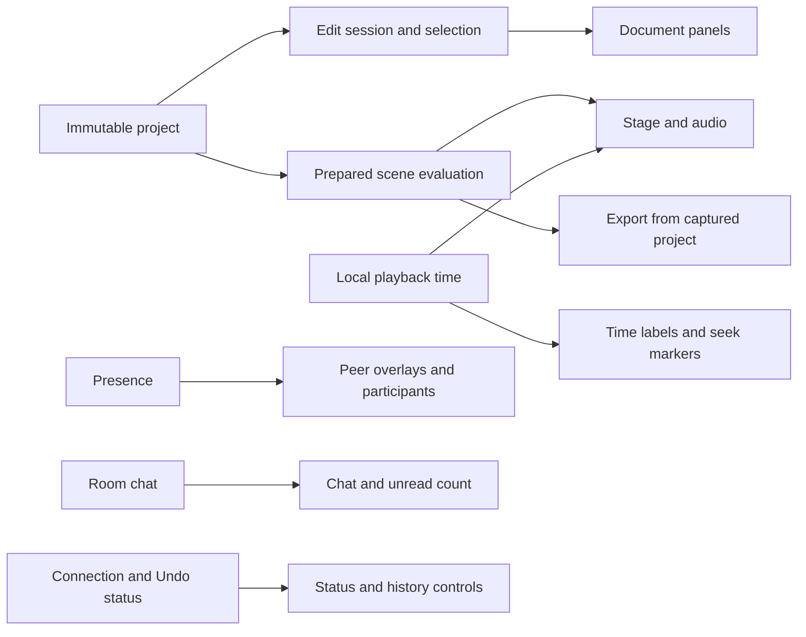

# Poietra

**Make motion together, with friends and AI.**

Poietra is a collaborative motion editor that runs in the browser. Arrange shapes,
text, equations, images and video; animate their properties; mix audio; and export
MP4 or WebM. Friends and the AI assistant edit the same structured objects, so
individual positions, colors and timings remain editable.

[Open Poietra](https://poietra.com) · [日本語の使い方・設定](apps/studio/README.md) ·
[Run locally](#run-locally) · [API / MCP](https://poietra.com/developers/) · [Architecture](#how-it-is-built) ·
[Performance](#performance) · [Issues](https://github.com/Poietra/poietra/issues)


This repository contains the **MoonBit implementation** of
[poietra-hackathon](https://github.com/Poietra/poietra-hackathon). Application logic
runs as MoonBit-generated JavaScript, with a WebAssembly motion kernel and native
adapters for browser APIs and JavaScript libraries. Executable application TS/TSX
has been removed; internal refactoring and performance work continue.

Documentation reviewed **2026-09-22**. The browser/developer-page release is
[`396c26b`](https://github.com/Poietra/poietra/commit/396c26b879bc528ca2066ac2b68675216a9e4e4a).
Cloudflare hosts the editor, documentation and schemas. The headless renderer
runs as a self-hosted Node service or local MCP process, with no hosted render endpoint.
The MoonBit service was last verified in production on **2026-09-22**;
see [deployment status and operations](#deployment-and-limits).

## What you can make

- Share a room link and edit together, with presence, offline reconnection and
  Undo scoped to your own edits. Guests can create and edit projects.
- Compose circles, rectangles, text, LaTeX, Bézier paths, arrows, number lines,
  images and video. Align, group or parent objects and edit their anchors.
- Animate properties with separate start times, durations and easing. Add actual
  intermediate values for returns, pauses and color changes; use Move, Write,
  Fade, Grow or Cut, including custom Bézier easing.
- Import and trim audio/video, adjust volume and export the project or a Scene.
  Save a portable project file containing its media.
- Ask `@codex` in shared chat for structured edits or generated image assets.
  Apply a proposal manually, or send with Ctrl/⌘+Enter to apply after validation.
- Optionally sign in with Google or GitHub to keep a private list of project
  shortcuts. Search by name, sort the list and undo its most recent removal.
  Shared-link editing remains available without login.

The [studio guide](apps/studio/README.md) covers editing, accounts, media,
shortcuts, AI configuration and export. Desktop Chromium is the primary tested
browser; codec support depends on the browser and device.

## Run locally

Use Node.js **24+** (tested: 24.13.0), pnpm **10.23.0**, Python **3.12+** for
adapter generation, and the compiler pinned in [.moon-version](.moon-version)
(`moonc v0.10.13+cbb11c36f`). The following commands use a POSIX shell.

```sh
git clone https://github.com/Poietra/poietra.git
cd poietra
pnpm install --frozen-lockfile

curl -fsSL https://cli.moonbitlang.com/install/unix.sh -o /tmp/install-moonbit.sh
bash /tmp/install-moonbit.sh "$(cat .moon-version)"
export PATH="$HOME/.moon/bin:$PATH"
node scripts/moon.mjs update

pnpm dev
```

Open **http://localhost:5173**. The homepage opens a new project or an editable
sample; viewing it alone does not create a room or load the editor. Node stores
local data in `apps/studio/.data`. Editing, collaboration, ordinary chat and export
work without an API key. Optional AI/OAuth settings go in `apps/studio/.env`;
see [configuration](apps/studio/README.md#設定).

Run these commands from the **repository root**:

| Command | Purpose |
| --- | --- |
| `pnpm dev` | Build MoonBit and start the Node/Vite development host on port 5173 |
| `pnpm build:moonbit` | Regenerate adapters and facades; build release JS and motion WASM |
| `pnpm build` | Build MoonBit, check types, bundle the editor and prerender EN/JA HTML/Markdown |
| `pnpm --dir apps/studio start` | Serve the completed production build with Node |
| `pnpm test` | Audit sources, build, run extension/API build tests and Vitest |
| `pnpm test:render` | Check headless rendering, independent decoding, HTTP and MCP after building |
| `pnpm render INPUT --format mp4 -o OUTPUT` | Render a portable file without a browser or FFmpeg |
| `pnpm render:api` / `pnpm render:mcp` | Start the local HTTP API / stdio MCP server |
| `pnpm typecheck` | Check declarations and captured public API contracts |
| `pnpm audit:source` | Report source inventory and reject executable application TS/TSX |

After editing `.mbt`, run `pnpm build:moonbit`: Vite does not compile MoonBit.
Restart the Node host after server-side changes. The wrapper
`node scripts/moon.mjs` selects `POIETRA_MOON`, then `.tools/moon/bin/moon`, then
`moon` on PATH. Use it for `update`, `check`, `test` and `version --all` so local
commands use the same toolchain as the build.

## Headless rendering, API and MCP

[apps/render](apps/render/) accepts saved `.poietra.json` files and returns SVG,
PNG or H.264 MP4. It runs in Node 24+ without Chromium, FFmpeg, WebCodecs, native
codec executables or runtime network access. Install the workspace dependencies
and build MoonBit first; fonts and codec WASM come from pinned local packages.

```sh
pnpm build:moonbit
pnpm render project.poietra.json --inspect
pnpm render project.poietra.json --format mp4 --width 1280 --fps 30 -o result.mp4
pnpm render:api
```

HTTP accepts the portable JSON body at `POST /render` and returns the binary
result. `POST /inspect` reports structural compatibility; `GET /capabilities`
lists supported formats and limits. Stdio MCP exposes `poietra_capabilities`,
`poietra_inspect` and `poietra_render`; the latter two use local file paths.
The [Node API](apps/render/index.d.mts) also supports progress and AbortSignal.
See the [Japanese setup and request examples](apps/studio/README.md#ファイルから描画する-api--mcp).

The [developer page](https://poietra.com/developers/) and
[Japanese page](https://poietra.com/ja/developers/) include a working quickstart,
MCP configuration and an editable sample. Agents can discover the
[OpenAPI 3.1.1 specification](https://poietra.com/openapi.json),
[project JSON Schema](https://poietra.com/schemas/project.json) and
[starter file](https://poietra.com/examples/hello.poietra.json) through
[llms.txt](https://poietra.com/llms.txt). The public specification targets
`http://127.0.0.1:8799`; the local service's `/openapi.json` uses its actual origin.
MCP resources expose `poietra://docs/openapi`, `poietra://docs/project-schema`
and `poietra://examples/hello`. Documentation endpoints are public even when
render/inspect/capabilities require a configured bearer token.

Cloudflare serves prerendered HTML or Markdown at `/developers/` and
`/ja/developers/`, selected by `Accept` and `Accept-Language` with matching `Vary`
headers. Explicit `index.md` paths also work. Pages need no application JavaScript;
OpenAPI, schema and examples are Static Assets with cross-origin read headers.
`developer_site` generates both page representations; `render_api` generates
the contract and sample; `project_codec` derives structural JSON Schema from its
file-validation definitions. Runtime validation additionally checks references,
timing and renderer support. Preview these pages with `pnpm build` followed by
`pnpm --dir apps/studio start`.

| Area | Headless support |
| --- | --- |
| Drawing | Shared shapes, text, Japanese fonts, MathJax, Write and Glow |
| Animation | Composition/Transition timing, parent transforms, intermediate values and multiple Scenes |
| Images | Embedded PNG/JPEG; WebP and external URLs are rejected |
| Audio | Embedded mono/stereo PCM WAV, trimming, resampling, gain and mute; MP4 contains MP3 audio |
| Not yet supported | Imported video, compressed source audio, WebM output and AAC encoding |
| Limits | 32 MiB input, 64 MiB output, 1920 px per side and 2,073,600 pixels; MP4 ≤60 seconds and ≤1800 frames |

The HTTP server binds to loopback by default and requires a bearer token when
binding elsewhere. HTTP/MCP each serialize renders; every render owns a worker
thread, terminated on cancellation or timeout (120 seconds by default).
CLI/MCP publish complete files without overwriting existing paths. Unsupported
content fails explicitly. Inspection does not decode assets; malformed media can
still fail during rendering. This is a Node service; compatibility with Cloudflare
Workers and deployment of a hosted render endpoint remain unverified.

## How it is built

The [MoonBit packages](moonbit/) hold application behavior.
[apps/studio/](apps/studio/) holds native facades, styles, assets and integration
tests. The pure editing/evaluation core is independent of React and host APIs.

| Layer | Main packages | Responsibility |
| --- | --- | --- |
| Model and engine | `scene`, `motion`, `geometry`, `render`, `audio`, `exporting`, `editor`, `proposal_plan` | Typed documents, edit plans, prepared evaluation, geometry and audio mixing |
| Collaboration | `collaboration`, `boundary`, `browser_editor`, `browser_undo`, `browser_chat` | Yjs leaf edits, immutable snapshots, selective Undo and shared chat |
| Browser | `ui`, `browser_render`, `browser_media`, `browser_export`, `browser_projects`, `browser_kernel` | React UI, drawing, resource lifetimes, decoding, export and portable files |
| Portable files | `project_codec` | Shared generated record adapters, bounded parsing and document validation |
| Headless rendering | `render_job`, `media_pipeline`, `headless_render`, `render_http`, `render_api`, `math_render` and `apps/render` | Typed render orchestration, media contracts, JS/HTTP boundaries, OpenAPI, WASM codecs and MCP |
| Services | `schemas`, `proposals`, `ai_service`, `auth_policy`, `auth_service` | Input validation, guarded AI proposals, OAuth and private project lists |
| Hosts and storage | `node_*`, `worker_*`, `room_assets`, `r2_upload`, `http_policy`, `http_runtime` | HTTP/WebSockets, persistence, quotas and atomic media publication |
| Public site | `site`, `site_shell`, `site_boundary`, `browser_site`, `developer_site`, `site_build` | Localized content, lazy editor entry, developer documentation and prerendering |
| Browser linking | `client_runtime` | Generated shared entry for six browser packages |

### Document and collaboration contracts

| Concept | Scope |
| --- | --- |
| Project | Ordered Scenes; portable saves include media, excluding account data and chat |
| Scene | Canvas, object identities, parent links and independent audio tracks |
| Composition | A still state, its hold duration and each object's independent appearance/transform |
| Transition | Animation between adjacent Compositions, with object and property timing |
| Account | Private sessions and room shortcuts, separate from room editing access |

Parent transforms compose as affine matrices. Reparenting preserves geometry in
all Compositions, including retained states; anchor edits compensate position in
the edited state. Sparse shear preserves rotated, nonuniform scales. Evaluated
world matrices are runtime data.
Visibility, opacity, paint order and selection groups remain independent of
parenting. Intermediate keyframes hold actual values at normalized times within
a property's interval, with Composition-linked endpoints and outgoing-segment
easing. Reparenting preserves Composition poses; intermediate keys and paths stay
in parent coordinates and may need adjustment. These features use document
version 2; version 1 files remain readable.

Yjs stores changes at individual fields. Readers receive immutable, structurally
shared snapshots; writers invalidate touched branches before observers run.
Structural deletion and keyframe deletion retain CRDT records. Selective Undo
preserves received peer edits, including dependent parent/point changes, and may
retain a shared creation with a notice. Unreceived offline work cannot be known.
Pending Yjs dependencies are persisted even before they affect the visible view.

Room transport now targets 500 participants, with a 512-socket admission cap to
leave reconnect headroom. `client_presence` sends only the local awareness clock;
remote changes still notify the UI. Browser cursor emission adapts from 50 ms to
1 second as the room grows, and received presence packets publish one UI snapshot
per 16 ms while reusing unchanged peers. Selection and local editing stay immediate.
Cursor throttling compares context values: repeating the same Scene/Composition
IDs does not bypass it. Actual context changes, selection and pointer exit flush
pending presence immediately.

`client_sync` uses y-websocket's public `WebSocketPolyfill` option to losslessly
merge outgoing document updates. The local document, rendering, IndexedDB and Undo
still update immediately. The first queued update starts a bounded timer: 16 ms
up to 32 peers, 50 ms above that; further edits do not postpone it. Queues flush
at 128 updates / 256 KiB, before sync/control frames and close, on gesture end or
Undo/Redo, and when the page is hidden. A disconnected socket discards its queue;
the existing document and IndexedDB participate in the normal reconnect handshake.
Each socket owns its timer, so an old connection cannot publish on its replacement.

`server_sync` shares bounded output batching between Node and Workers. Worker
input batches are losslessly merged with Yjs, journaled in one SQLite transaction,
then applied and published. Ordered sync replies flush pending input first, so
portable-file creation still waits for durable acknowledgment. Up to 32 sockets,
document batching uses the next timer turn without an added delay; larger rooms
use nominal 10 ms input / 50 ms output windows. Both queues retain at most 128
small updates or 256 KiB before flushing; a larger individually valid update
flushes immediately. The journal compacts at 256 batches or 4 MiB. Unresolved Yjs
dependencies remain in both merged journal entries and snapshots.

Presence coalesces over 100 ms and keeps the latest clock per client. Socket and
owner indexes rebuild from attachments after hibernation; stale closes cannot
remove a replacement. A replacement retires the old socket and releases its
admission slot immediately. Full rosters are split into packets accepted by older
clients: at most 100 entries and 16,000 bytes. Each entry is encoded once, and its
actual UTF-8 bytes determine the packet boundary. Native socket sends use the
existing typed mizchi binding. Node disconnects clients with more than 1 MiB of
queued output; the
Workers WebSocket API does not expose Node's `bufferedAmount`, so that guard is
Node-specific. This transport keeps the existing room authority and storage
schema; it does not introduce a new namespace or document format.

[Product rules](apps/studio/AGENTS.md) define these contracts, and
[root implementation rules](AGENTS.md) describe the editing boundaries to preserve.

### UI, rendering and resource ownership



Playback preparation resolves segments, tracks, hierarchy, layer order and curves
once; repeated evaluation uses the shared engine for preview and export. Editing
reads the current Composition. Static holds without visible video can reuse a
prepared frame while export still encodes every timestamp.

Document panels, presence, chat and the local clock have separate subscriptions.
Scene tabs, layers, timeline structure and media rows retain presentation inputs
when their displayed fields stay unchanged. Resource preparation depends on text
across Compositions and visible image assets, so pose/timing edits reuse resources.
A failed preparation can be retried without changing the document.

One typed render view drives serialized SVG and retained stage nodes. Opaque
shapes without effects use cached native geometry for direct Canvas painting;
opacity and Glow retain isolated compositing. Sequential video decoding keeps
owned pixel surfaces and resets on seeking. Async owners suppress stale results,
release resources on cancellation and preserve encoder/upload backpressure.

The headless path reuses `scene.PreparedScene`, `motion`, `render`, `audio` and
`exporting`; `math_render` shares equation preparation across browser and Node.
Static holds reuse rasterized pixels while every output frame remains encoded.
The document schema and public JS API remain unchanged.

`render_job` accepts a typed `RenderRequest` and `Backend` and returns a
`RenderResult`. It owns timeline evaluation, validation, audio mixing and the
render loop, with no `Any`, JS FFI or HTTP dependency. The prepared timeline hides
its mutable internals; callers must keep its source project stable until done.
`headless_render` converts native host objects through opaque FFI handles and
checks buffers before constructing typed values. `render_http` owns HTTP routing;
CLI and MCP use the same Node facade. Node adapters own worker threads, I/O and
npm codecs. `project_codec` supplies the shared portable-file parser and generated
record marshalling, so headless rendering no longer imports the editing boundary.

The reusable [media_pipeline package](moonbit/media_pipeline/model.mbt) has no
Poietra model, host or external package dependencies. It defines checked
`RgbaFrame` and stereo `StereoPcm` values, typed rasterizer/audio/encoder ports,
and `with_encoder` for cleanup. Frame/sample buffers remain owned by the producer
until each awaited consumer returns. Normal completion, failures and cancellation
release the encoder once; cleanup failure preserves the original render error.
Standalone consumer tests compile this package on JS and WASM and reject swapped
audio/video inputs, unchecked frame construction and incompatible callbacks.
It is an internal reusable package, not a published registry module. Separate
publication can follow another consumer's requirements without extracting Scene
semantics or the Node codecs into this interface.

For this backend, SVG is rasterized by [resvg WASM](https://github.com/thx/resvg-js),
H.264 is encoded by [minih264](https://github.com/TrevorSundberg/h264-mp4-encoder),
and [Mediabunny](https://mediabunny.dev/) muxes packets without a second encode.
Audio uses its [MP3 extension](https://mediabunny.dev/guide/extensions/mp3-encoder)
and [LAME](https://lame.sourceforge.io/). Dependencies are pinned in
[apps/render/package.json](apps/render/package.json). License notices include
resvg/MPL-2.0, the H.264 wrapper/MIT, minih264/public domain, libmp4v2/MPL-1.1,
the MP3 extension/MPL-2.0 and LAME/LGPL; retain their upstream notices when distributing.
After inspecting [mizchi/canvas-mbt](https://github.com/mizchi/canvas-mbt), we
kept the existing SVG representation because its current
[missing filters and shadows](https://github.com/mizchi/canvas-mbt/blob/main/TODO.md)
would leave Glow unsupported. Backend conformance tests cover SVG `pathLength`,
actual H.264 keyframes and MP3 priming; browser-identical rasterization is not claimed.
The resvg host still adapts SVG path lengths after serialization and buffers an
intermediate H.264 MP4 before final muxing. Typed boundaries do not remove those
remaining compatibility and long-video memory constraints.

### Build and host boundaries

`pnpm build:moonbit` produces release modules under `_build/` and copies the motion
WASM into `apps/studio/public/wasm/`. Generated code has three sources of truth:

| Source | Generated output |
| --- | --- |
| [scene model](moonbit/scene/model.mbt) via [generate-adapters.py](scripts/generate-adapters.py) | [Shared record marshalling](moonbit/project_codec/adapters.mbt) and public [scene types](apps/studio/shared/scene-types.d.ts) |
| [bindings.json](scripts/bindings.json) | Simple native JS facades forwarding public calls |
| Package `moon.pkg` exports via [client-runtime.mjs](scripts/client-runtime.mjs) | Shared browser entry/export tables |

The browser links `boundary`, `browser_editor`, `browser_media`, `browser_render`,
`browser_undo` and `ui` once through `client_runtime`. The
[Vite adapter](apps/studio/scripts/moonbit-client.mjs) redirects browser imports
and rejects duplicate standalone copies. Node, Worker and SSR use standalone
artifacts. The homepage, file/export operations, MathJax and Mediabunny retain
separate or lazy loading. Do not edit generated tables or duplicate domain records.

The [MoonBit dependency pins](moon.mod) include mizchi's JS bindings **0.13.0**,
`npm_typed` **0.1.16** for React/Zod and `cloudflare` **0.1.12** for selected
SQLite/R2 bindings. React/Base UI, Yjs, MathJax, Mediabunny and the OpenAI SDK remain
JavaScript runtime dependencies. Native adapters connect those APIs to MoonBit;
package versions are pinned in [package.json](apps/studio/package.json) and
[pnpm-lock.yaml](pnpm-lock.yaml).

### What the remaining TypeScript represents

Source audit rerun **2026-09-22**, including the standalone render host:

| Source purpose | Files | Physical lines |
| --- | ---: | ---: |
| MoonBit application | 302 | 60,444 |
| Native JS runtime adapters | 119 | 1,326 |
| Executable application TS/TSX (studio and render hosts) | 0 | 0 |
| TypeScript tests, fixtures and test configurations | 150 | 16,849 |
| Public/environment type declarations | 114 | 1,978 |
| TypeScript benchmark/tool configuration | 5 | 140 |

These counts include generated code, comments and blanks; they exclude external
library implementations and do not measure delivered bytes. Use `pnpm audit:source`
or `node scripts/source-inventory.mjs --json` for the full inventory, including
MoonBit tests and JS tooling. CI rejects executable TS/TSX in the four studio
application directories and the render host. Historical comparison implementations are available in Git and
[poietra-hackathon](https://github.com/Poietra/poietra-hackathon).

Internal refactoring remains: [media editing commands](moonbit/browser_editor/media_commands.mbt)
still merge native patches before validation, and some UI/host orchestration uses
`Any`. Document Context adapters still observe edits even when panel content is
reused. Further work is to move domain decisions into typed plans, narrow those
subscriptions and reduce the still-large editor entry. Zero executable TS is an
inventory result, not completion of these changes.

## Add a feature

1. Define domain data in `moonbit/scene/model.mbt` and kinds in
   `moonbit/scene/kinds.mbt`. Put pure edit decisions in `editor` and shared
   evaluation in `scene`/`motion`; keep React, Yjs and platform objects at the host
   boundary. Read the applicable [implementation](AGENTS.md) and
   [product rules](apps/studio/AGENTS.md).
2. Implement validation, persistence compatibility, commands, evaluation,
   rendering and UI as needed. Generated record types do not implement these
   behaviors. Object creation, clipboard and media imports share
   `editor.ObjectInsertion`; Scene/Composition defaults use `scene/creation`, with
   limits and creation decisions in `editor/structure_commands`.
3. Preserve collaboration intent. Property channels share enumeration/lookup in
   `scene/editing`; typed plans identify changed leaves. Retain existing Yjs
   timing parents. Validate all targets and encode detached values before any
   write: a Yjs transaction cannot roll back earlier writes when conversion fails.
4. Export host-facing functions in the package's `moon.pkg`, with a precise
   adjacent `.d.ts` contract and a `scripts/bindings.json` entry for direct
   forwarding. Run `pnpm build:moonbit` to regenerate adapters/facades/shared
   exports. Check existing mizchi bindings before adding a native API boundary.
5. Run `pnpm test`, `pnpm typecheck`, pure-core tests on JS/WASM, and the
   [relevant browser/runtime checks](#checks). Verify preview/export agreement,
   offline edits and selective Undo for changes that affect those behaviors.

`pnpm test:extensions` adds a nested optional record and callable API in an
isolated copy, regenerates and compiles them, checks standalone/shared-runtime
calls and rejects incorrect TypeScript consumer fields. The contract gate checks
108 captured public modules while allowing new exports; shared-runtime tests
compare 219 function exports and their arity.

For a headless backend, implement `render_job.Backend` using the contracts in
`media_pipeline`; keep native conversions in its adapter. New formats belong in
`render_job.Format` and its exhaustive matches. Add media contracts only when a
consumer needs them, and preserve the standalone JS/WASM compilation test.

## Checks

The room scalability changes were verified on **2026-09-22** with
715 Vitest checks, five build/API checks, 51 MoonBit JS checks, a warning-free
MoonBit type check, public TypeScript contracts and a production web build.
Actual workerd verified offline edits, selective Undo, ordered durable replies,
compaction, hibernation, late closes, process restart and pending dependencies.
The load-test results and generator limitations are recorded below.
The presence-encoding follow-up also passed actual workerd recovery and 500-client
convergence checks, including an old awareness client and one real browser. Its
tests decode bounded Unicode rosters and preserve safe-integer IDs/clocks and
removals with the unchanged awareness protocol.
Application revision `79531b9`, including the presence-encoding follow-up,
passed the complete
[CI run 35680387634](https://github.com/Poietra/poietra/actions/runs/35680387634),
including browser/export/media, persistence, R2 and account integrations.

The preceding API/MCP documentation addition was verified on **2026-09-22**:
19 headless/contract tests, 701 Vitest checks, five build/API checks, 51 MoonBit
JS tests, 48 WASM checks, public type contracts and a complete production build.
All 28 production-page browser checks passed, including English/Japanese
developer pages at 1440/390 px with JavaScript disabled. The final typography
adjustment passed the two developer-page checks again. Raw HTTP checks passed
against both Node and real local workerd for HTML/Markdown negotiation, locale,
HEAD, cache validators, real 404s, OpenAPI/schema/example/configuration files;
workerd also verified Static Assets CORS headers. OpenAPI metadata was checked
against the official 3.1 schema; request and response schemas are tested against
actual API responses, including an authenticated MP4 render of the public sample.
The real-workerd collaboration suite also passed offline edits, selective Undo,
hibernation, compaction, process restart and pending update recovery. Public HTTP
and both developer-page browser checks passed again against `poietra.com` after
deployment, and its downloaded sample rendered locally to a 30-frame MP4.

Nine targeted browser regressions also passed on **2026-09-21** for portable
files/images, parenting/keyframe round trips, equation geometry, resource
invalidation/recovery and shared SVG rendering. The headless checks decode all
H.264 frames and MP3 samples with independent WASM
decoders, verify timing/trim/gain/mute, exercise HTTP/MCP, oversized requests and
cancellation, and render with subprocess launches and network fetch disabled.
They also verify typed-package isolation, invalid consumer rejection, native
buffer validation, encoder backpressure, single cleanup and error preservation.
CI runs them before installing Chromium or FFmpeg.

Application revision `8b3370a` passed
[CI run 35527411897](https://github.com/Poietra/poietra/actions/runs/35527411897):
700 Vitest checks, five build/API checks, 49 MoonBit JS tests, 42 WASM tests,
173 main browser checks, eight export checks, six media checks and 26 production
page checks, plus actual Node/workerd persistence, hibernation, restart, R2 and
account/TTL integrations. [.github/workflows/check.yml](.github/workflows/check.yml)
is the authoritative selection; these counts describe that run.

The targeted local account/project suite also passed all 15 browser checks on
frozen sources. It covers search/order, failed reads, restoration retries,
identity changes, delayed replies and guest project operations. Authentication
HTTP responses are mocked in those UI tests; separate Node/workerd integrations
exercise persistent account isolation, callback races and expiry.
On 2026-09-22 the capacity test was synchronized with the initial automatic
visit after CI recorded a click while that visit disabled the controls. All 15
checks and ten consecutive capacity checks passed locally. The full run for
this test-only change passed [CI 35625067075](https://github.com/Poietra/poietra/actions/runs/35625067075).

```sh
# Repository root
pnpm test
pnpm test:render
pnpm typecheck
node scripts/moon.mjs check --target js --deny-warn
node scripts/moon.mjs test --target js
node scripts/moon.mjs test --target wasm moonbit/motion moonbit/proposal_plan moonbit/editor moonbit/scene
node scripts/moon.mjs test --target wasm moonbit/render moonbit/exporting moonbit/audio moonbit/media_pipeline moonbit/render_job
pnpm build

# apps/studio
cd apps/studio
pnpm exec playwright install chromium
pnpm test:e2e
pnpm test:export
pnpm exec playwright test --config tests/e2e/media-export.config.ts
pnpm exec playwright test --config tests/e2e/site-production.config.ts
node tests/collaboration-worker.integration.mjs --port 8796
node tests/media-storage.integration.mjs node
node tests/r2-assets-worker.integration.mjs
node tests/accounts-worker.integration.mjs
```

Browser video checks require FFmpeg/ffprobe; `pnpm test:render` does not.
On Linux, Playwright may also need browser
system dependencies (`pnpm exec playwright install --with-deps chromium`).
Use an isolated local test host: browser tests create and edit rooms. The default
E2E configuration uses port 5173 and may reuse an existing server; set
`POIETRA_TEST_URL` to a dedicated host if that port belongs to your development
session. The production-page configuration serves the completed build separately.

Automated provider HTTP is simulated. Production smoke verified GitHub's
authorization redirect and flow storage; full Google/GitHub login completion and
paid OpenAI calls were not part of this release's verification.

## Performance

Measurements are stored in [benchmarks/](benchmarks/) with source/artifact hashes,
environment, workloads and raw samples. The following results describe specific
local fixtures. Production CDN delivery, real mobile hardware, WAN collaboration
and long source-media projects need separate measurement.

### Same-room collaboration — 2026-09-22

Real local workerd, one room and one object per participant, on the same Intel
Core Ultra 7 255H / 32 GB WSL2 host as eight Node client-generator threads; CPU
affinity 0–15. Node 24.13.0, MoonBit 0.10.13+cbb11c36f, Wrangler 4.131.2,
workerd 1.20260911.1, Yjs 13.6.32 and y-websocket 3.1.0. Every run synchronized
all clients, waited one second, then staggered periodic property/presence edits.
Builds, tests and encoders did not run concurrently. These are local end-to-end
delivery measurements, including client scheduling and Yjs application.

The 32-client comparison used two edits and ten presence updates per second per
client for ten seconds, with three samples at each revision. Incoming room
messages fell from **103,008–103,040 to 3,839–3,840: about 96.3% fewer**, principally
by stopping remote-awareness echoes. Peer-edit p95 was **9–14 ms** afterward;
the preceding implementation varied from **43–1,129 ms**, so a fixed latency
speedup is not claimed. All final states converged, with no disconnected clients.
The [raw results](benchmarks/2026-09-22-collaboration/) named
`delivery-before-32-*` and `delivery-after-32-*` use the same harness `3a04bf8`,
comparing application `115ed1e` with `72f05a2`.

Longer runs used one edit and one presence update per second per protocol client:

| One-room workload | Duration / edits | Peer delivery p50 / p95 | Final convergence / disconnects |
| --- | --- | --- | --- |
| [500 protocol clients](benchmarks/2026-09-22-collaboration/soak-500.json) | 60 s / 29,998 | 526 / 1,750 ms | 60.422 s / 0 |
| [499 protocol clients + one browser](benchmarks/2026-09-22-collaboration/soak-browser-500.json) | 60 s / 29,940 | 318 / 539 ms | 60.259 s / 0 |

Both runs checked every client's final poses and edits/presence after forced
hibernation. The browser run used headless Chromium 153.0.8010.12: no page errors
or long tasks were observed during the measured load; rAF intervals were
16.7 ms at p95. Its own edit, made **after** the load, reached all protocol clients
in 196 ms. This is one browser on a local machine, not 500 rendered browsers or
real-device FPS. Protocol clients received about 439 MB on the wire during that
run with `permessage-deflate`; logical decoded traffic was about 2.83 GB.

Raw files record frozen artifact hashes and harness revisions (`3a04bf8` /
`29a8366`). Both long runs measured application `72f05a2`, before the final
socket-retirement fix. Generator process RSS reached 15–16 GB; those hundreds of
client documents are not the Worker heap. Intermediate, high-rate, legacy-client
and rejected generator experiments remain under
[exploratory/](benchmarks/2026-09-22-collaboration/exploratory/).

Latency still varies at 500 participants. This verifies the stated one-minute
workloads and final convergence, not 500 people continuously dragging at high
frequency, long-duration endurance or WAN performance. The room remains a single
authoritative Durable Object; Cloudflare documents a workload-dependent
[soft limit of 1,000 requests/s per object](https://developers.cloudflare.com/durable-objects/platform/limits/).
Batching reduces persistence/fan-out overhead but does not remove that inbound
event limit or the cost of delivering everyone's edits to everyone else.

The client follow-up on 2026-09-22 fixes a gap in the earlier cursor tests: the
canvas includes unchanged Scene/Composition IDs in every move, while the old
throttle recognized only single-field cursor patches. The real workerd regression
now opens 500 sockets (one browser, one document observer and 498 idle roster
connections) and drives the actual canvas. With controlled browser time, 20 moves
at 41 ms intervals plus a 180 ms trailing drain produce one presence publication.
A burst of 90 drag moves without advancing the browser clock changes the local
inspector immediately and flushes one document update on pointer release. The peer
receives the final position, and Undo retains its independent color edit. A separate
transport test advances time by 16 ms between 90 edits: it produces 23 packets
with a 50 ms window and final flush, demonstrating delivery during continuous input.
These are deterministic message-count and ordering checks, not latency or FPS
measurements. They do not establish 500 continuously dragging browsers. See
[the real-browser regression](apps/studio/tests/collaboration-worker.integration.mjs)
and [transport checks](apps/studio/tests/client-sync.test.ts).

To repeat the current implementation, build once, freeze the bundle and run
these commands sequentially from `apps/studio` (port 8796 must be unused):

```sh
pnpm build:web
pnpm exec wrangler deploy --dry-run --outdir /tmp/poietra-collaboration-bundle
node tests/collaboration-load.integration.mjs \
  --bundle /tmp/poietra-collaboration-bundle/index.js --owned-presence \
  --clients 500 --generators 8 --seconds 60 --edit-hz 1 --presence-hz 1 \
  --output /tmp/poietra-collaboration-500.json
# Repeat with --browser to include one real browser among the 500 participants.
```

The `79531b9` follow-up removes duplicate presence serialization and intermediate
host-record allocations. The decoder transfers its freshly owned selection array
instead of copying it again. Existing mizchi WebSocket bindings avoid a dynamic
method lookup and argument array on every send.

| Independently decoded fixture | Packets before | Packets after |
| --- | ---: | ---: |
| 64 ordinary cursor updates | 2 | 1 |
| 500-person ordinary roster | 10 | 6 |
| 500-person roster with long Unicode selections | 100 | 100 |

All entries, safe-integer clocks, null removals and UTF-8 data are preserved;
packets stay within 100 entries and 16,000 bytes for older clients. The unchanged
Unicode packet count reflects the byte limit. See the
[raw follow-up results and conditions](benchmarks/2026-09-22-collaboration/encoding/).
The three 15-second 500-client runs at each revision converged without disconnects
and passed hibernation checks. Separate 500-client checks with an old client and
a real browser passed too.

Unrelated C++ compilation was observed on this shared host during these follow-up
runs. **Their wall times are exploratory, not evidence of an end-to-end latency
or encoding-time speedup.** The earlier `72f05a2` timing records above describe
their own runs. A new isolated timing comparison is still required. The harness
now separates document/presence traffic and supports local workerd CPU profiling
with `--profile-worker /tmp/room.cpuprofile`; profiling results are separate from
latency comparisons. Stop other builds before timing. To repeat the encoder check
from the repository root after building:

```sh
node apps/studio/scripts/benchmark-presence.mjs \
  --module _build/js/release/build/server_presence/server_presence.js \
  --output /tmp/poietra-presence.json
```

### Headless export — 2026-09-21

Local Node 24.13.0 on an Intel Core Ultra 7 255H, WSL2 Linux, CPU affinity 0–15.
Each workload received one warmup and three sequential samples in fresh processes
and worker threads, with frozen sources and no concurrent builds/tests/encoders.
The fixture is **1280×720, 30 fps, 3.4 seconds / 102 frames**, with Japanese/Latin
text, MathJax, Glow and an embedded PNG. Audio adds trimmed stereo WAV at half gain
and a muted track. [Before typed boundaries](benchmarks/2026-09-21-headless/render.json)
and [after the refactor](benchmarks/2026-09-21-headless/typed-render.json) record raw
samples, source/artifact hashes and dependency versions for the working trees on
top of `4a68767`. Both use the same harness and input hashes.

| Workload | Before, median | Typed, median [min–max] | Rasterized / encoded frames | MP4 bytes |
| --- | ---: | ---: | ---: | ---: |
| Static hold | 1,125 ms | 1,117 [1,112–1,135] ms | 1 / 102 | 26,232 |
| Animated intermediate value | 1,461 ms | 1,421 [1,410–1,423] ms | 26 / 102 | 31,798 |
| Animation with audio | 1,507 ms | 1,506 [1,505–1,526] ms | 26 / 102 | 115,260 |

Wall time includes worker startup, module/WASM/font loading, MathJax, rendering,
encoding, muxing and thread teardown; it excludes parent-process startup,
file/network transfer and independent decoding. Whole-process peak RSS ranged
from **229–269 MiB** after the refactor; this is not a Cloudflare Worker heap
measurement. The short, unpaired samples show no material slowdown in this fixture;
they do not establish a general speedup, a browser comparison or a long-video SLA.

```sh
pnpm build:moonbit
# Freeze sources/artifacts; run with no other build, test or encoder in progress.
node scripts/benchmark-headless.mjs test-results/headless-benchmark.json
```

### Shared browser linking — 2026-09-20

Application `0cda0c5` links the six browser packages once. Its baseline is
`2c00643` (application `99a349d`); standalone boundary/editor and WASM artifacts
remained identical. [Bundle before](benchmarks/2026-09-20-client-linking/bundle-before.json)
and [after](benchmarks/2026-09-20-client-linking/bundle-after.json) record all files
and hashes.

| Static JS group | Before | After |
| --- | ---: | ---: |
| Editor, raw | 1,883,417 B | 1,610,705 B (−14.5%) |
| Editor, gzip level 9 | 524,141 B | 457,443 B (−12.7%) |
| Editor, Brotli | 401,036 B | 371,942 B (−7.3%) |
| Homepage, gzip level 9 | 91,072 B | 91,134 B (+62 B) |

Groups include static imports; the homepage also includes its selected entry.
Dynamic editor modules, CSS, fonts and media are excluded. Compression is computed
per file, using Node's default Brotli settings, rather than measured on the wire.

Cold startup used three fresh contexts per build, no warmup, one pre-seeded
circle, a 412 × 823 viewport, disabled cache, 4× CPU slowdown, 150 ms HTTP latency,
200,000 B/s download and 93,750 B/s upload. Hardware: Core Ultra 7 255H, 32 GiB,
WSL2, CPUs 0–15; Node 24.13.0, MoonBit 0.10.13+cbb11c36f and Chromium 153.0.8010.12.
Runs were sequential with frozen artifacts and no concurrent local builds,
tests or encoders.

| Cold startup, median [min–max] | Before | After |
| --- | ---: | ---: |
| FCP | 1,680 [1,668–1,684] ms | 1,676 [1,668–1,676] ms |
| LCP | 11,340 [11,288–11,376] ms | 10,152 [10,148–10,172] ms |
| Circle in DOM + two animation frames | 11,903.9 [11,811.2–11,963.9] ms | 10,651.2 [10,648.7–10,651.7] ms |
| Observed long-task blocking sum | 354 [304–476] ms | 347 [338–354] ms |

Stage readiness improved **10.5%** in this fixture. The local Node server sends
uncompressed assets and uses local WebSockets; these are not production load
times. The stage metric is a presentation opportunity, not physical display or a
Web Vital, and the blocking sum is not Lighthouse TBT. Full samples:
[startup before](benchmarks/2026-09-20-client-linking/startup-before.json),
[startup after](benchmarks/2026-09-20-client-linking/startup-after.json).

A separate warm interaction run used 100/500 circles at 1440 × 900, one drag
warmup and three sets of 60 pointer moves, with a 1 ms CPU sampler. For 500 circles,
median delivery-to-DOM was **14.4 ms**, delivery-to-DOM plus two animation frames
was **33.4 ms**, and actual input spacing was **50.0 ms**. The three-second Scene
(two one-second holds and one-second transition) had rAF intervals of 16.7 ms
median, 49.9 ms p95 and 83.4 ms maximum. Long frames remain. This final run does
not establish an interaction speedup; it excludes pre-delivery input waiting,
media, WAN and hardware GPU behavior. [Samples and profiles](benchmarks/2026-09-20-client-linking/)
retain the full observations.

### Earlier measurement evidence

These datasets belong to earlier revisions; do not combine their speedups or
report them as fresh measurements of the current release. Previous explanations,
including unsuccessful/intermediate runs and old deployment records, remain in
[the README at 5468c56](https://github.com/Poietra/poietra/blob/5468c56/README.md#performance).

| Investigation | Retained evidence |
| --- | --- |
| Panel/resource invalidation | [Document updates](benchmarks/2026-09-20-document-updates/) |
| Clock, presence and chat subscriptions | [UI subscriptions](benchmarks/2026-09-20-ui-subscriptions/), including synchronous-clock regressions |
| Retained SVG and direct Canvas shapes | [Rendering, interaction, startup and WebCodecs](benchmarks/2026-09-20-retained-rendering/) |
| Parenting and value curves | [Primitives](benchmarks/2026-09-20-primitives/) |
| Lazy loading, static holds and export | [Startup](benchmarks/2026-09-20-startup/) and [interaction/export](benchmarks/2026-09-20-interaction/) |
| Typed editing plans | [Object edits](benchmarks/2026-09-20-editing/), [Transition timing](benchmarks/2026-09-20-timing/), [track timing](benchmarks/2026-09-20-tracks/) and [creation](benchmarks/2026-09-20-creation/) |
| Initial migration and video pipeline | [2026-09-19](benchmarks/2026-09-19/) and [optimized](benchmarks/2026-09-19-optimized/) |

The latest recorded export timing comparison is the retained-rendering experiment
(`4b2ae74` → `8357a35`). Its warmed 500-shape MP4 fixture, 90 frames at 720p/30 fps,
fell from **387.7 [382.5–395.2] ms to 342.0 [336.6–342.6] ms** (median [min–max]).
It used one warmup and three measured runs, fresh painter/encoder resources,
Chromium/SwiftShader on the same WSL2 machine with CPUs 0–15, and CDP profiling.
Other host activity was not isolated. It excludes source audio/video, module
loading and download handling; every
output's packet count and first decoded frame were checked. This is an engine
fixture, not a prediction for a user's video. See [export before](benchmarks/2026-09-20-retained-rendering/export-before.json)
and [after](benchmarks/2026-09-20-retained-rendering/export-after.json).

### Reproduce the measurements

Build once, then freeze sources and generated artifacts. Run workloads
sequentially, without other builds/tests/encoders. Default outputs go to ignored
`test-results/`; use distinct files for repeated runs. Historical comparisons
require the matching source revision and harness, not just today's scripts.

```sh
# Repository root: current MoonBit CPU suites in three fresh processes each
pnpm build
pnpm bench --runs 3 --output test-results/benchmarks/cpu.json

# Terminal 1, from the repository root: isolated production host
cd apps/studio
PORT=5188 NODE_ENV=production OPENAI_API_KEY= POIETRA_DATA_DIR=/tmp/poietra-perf \
  node server/index.js
```

```sh
# Terminal 2, from apps/studio; run each command to completion
pnpm exec playwright install chromium
POIETRA_PERF_URL=http://127.0.0.1:5188 node scripts/measure-home.mjs
POIETRA_PERF_URL=http://127.0.0.1:5188 node scripts/measure-editor.mjs
POIETRA_PERF_URL=http://127.0.0.1:5188 node scripts/measure-startup.mjs
POIETRA_PERF_URL=http://127.0.0.1:5188 node scripts/measure-interaction.mjs
node scripts/measure-bundle.mjs
```

`POIETRA_PERF_OUTPUT` selects a browser measurement's JSON file.
`measure-home` defaults to five runs per locale, `measure-startup` to three cold
runs (`POIETRA_PERF_RUNS`); `measure-editor` uses 30 inputs per scenario
(`POIETRA_PERF_SAMPLES`). Match affinity explicitly when comparing historical
runs: latest shared-linking results used CPUs 0–15; some earlier experiments used
measurement CPUs 0–3 and server CPUs 4–5.

Renderer/export harnesses import source modules through a **development** host
using the same release MoonBit artifacts. Keep this separate from startup runs:

```sh
# Terminal 1, apps/studio: stop the production measurement host first
PORT=5189 OPENAI_API_KEY= POIETRA_DATA_DIR=/tmp/poietra-render node server/index.js
```

```sh
# Terminal 2, apps/studio
node scripts/benchmark-rendering.mjs --url http://127.0.0.1:5189 --frames 60 \
  --output test-results/benchmarks/rendering-1.json
POIETRA_BENCH_URL=http://127.0.0.1:5189 node scripts/benchmark-export.mjs
POIETRA_PERF_URL=http://127.0.0.1:5189 node scripts/measure-subscriptions.mjs
POIETRA_PERF_URL=http://127.0.0.1:5189 node scripts/measure-document-updates.mjs
```

Rendering video fixtures require FFmpeg/libx264 (`--skip-video` omits them).
Export uses `POIETRA_BENCH_RUNS` and `POIETRA_BENCH_OUTPUT`. Subscription/document
probes count development StrictMode invocations, including retries and diagnostic
overhead; they are not production timing or FPS measurements.

## Deployment and limits

Node persists locally. Cloudflare serves Static Assets, stores room/account state
in SQLite Durable Objects and keeps media bytes in private R2. Default Wrangler
configuration is for isolated `poietra-moonbit` validation. The explicit
`production` environment updates the existing `poietra-hackathon` Worker in
Yumaboda's account, preserving `poietra.com`, old workers.dev links, three Durable
Object namespaces, migration tag `v2-accounts`, secrets and `poietra-assets-prod`.

**Last recorded deployment: 2026-09-22 11:56 JST.** Application `79531b9`
served at 100% as Worker version `ed47add7-6904-425e-8eb3-171315450e9e`.
Storage namespaces, secret bindings, variables, rate limits and runtime settings
matched the preceding release, including Static Assets routing and headers.
There was no document/storage migration. The recorded predecessor is
`3c91eea7-bf51-4b75-b33d-0b65e4387c99` (application `36c92bf`). Confirm the active
version before the next deployment instead of assuming this record is live state.

Verification used a dedicated room: release JS/WASM hashes, existing room/R2
restoration, upload deduplication, two-browser edits and selective Undo,
guest/account UI, GitHub authorization start, playback and seeking. A downloaded
720p MP4 decoded all 102 expected frames. Full provider login and paid AI calls
were outside this smoke check. The 500-client tests ran against isolated local
workerd, not the production domain. Reload existing editor tabs to use local-only
presence publication and the adaptive cursor interval.

Use the [studio deployment procedure](apps/studio/README.md#実行と配置) for local
workerd, version upload, activation and rollback. `pnpm --dir apps/studio run deploy`
only builds a **dry run**. A Worker rollback changes code/assets; it does not
restore room data. Any rollback must understand version 2 documents and persistent
account dismissals.

The [limits table](apps/studio/README.md#現在の制限) covers project structure, media,
keyframes and AI. Long projects, large media workloads and many WAN collaborators
still need performance evaluation; optional provider integrations need live
verification in the target environment.

The rewrite originated from public hackathon commit
`3f49040ee4bcf06bfcf02e269712833f3729c536`. The original
[hackathon application](apps/studio/docs/hackathon-application.md) remains a
historical record. Current behavior belongs in these READMEs and the product
rules; the separate private design archive was not imported.
