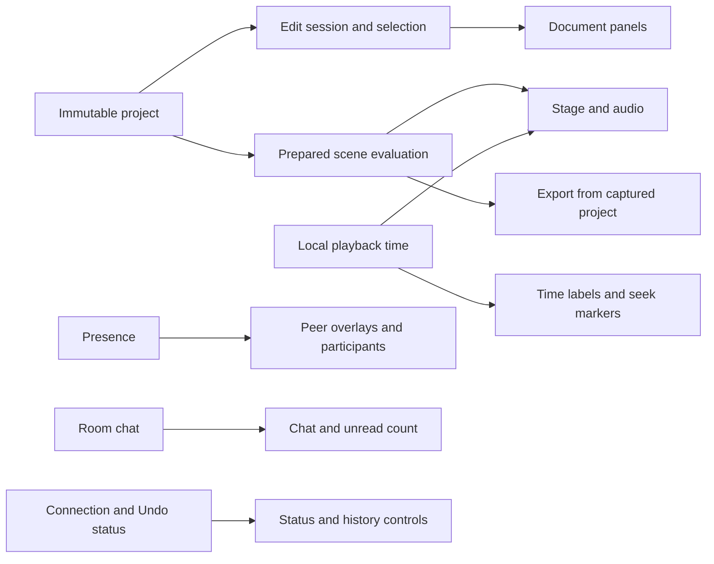

# Architecture

[Project overview](../README.md) · [Development and checks](development.md)

[Document and collaboration](#document-and-collaboration-contracts) ·
[Rendering and ownership](#ui-rendering-and-resource-ownership) ·
[Build boundaries](#build-and-host-boundaries) ·
[Source inventory](#what-the-remaining-typescript-represents)

The [MoonBit packages](../moonbit) hold application behavior.
[apps/studio/](../apps/studio) holds native facades, styles, assets and integration
tests. The pure editing/evaluation core is independent of React and host APIs.

| Layer | Main packages | Responsibility |
| --- | --- | --- |
| Model and engine | `scene`, `motion`, `geometry`, `render`, `audio`, `exporting`, `editor`, `proposal_plan` | Typed documents, edit plans, prepared evaluation, geometry and audio mixing |
| Collaboration | `collaboration`, `boundary`, `browser_editor`, `browser_undo`, `browser_chat` | Yjs leaf edits, immutable snapshots, selective Undo and shared chat |
| Browser | `ui`, `browser_render`, `browser_media`, `browser_export`, `browser_projects`, `browser_kernel` | React UI, drawing, resource lifetimes, decoding, export and portable files |
| Portable files | `project_codec` | Shared generated record adapters, bounded parsing and document validation |
| Headless rendering | `render_job`, `media_pipeline`, `headless_render`, `render_http`, `render_api`, `math_render` and `apps/render` | Typed render orchestration, media contracts, JS/HTTP boundaries, OpenAPI, WASM codecs and MCP |
| Services | `schemas`, `proposals`, `ai_service`, `auth_policy`, `auth_service` | Input validation, guarded AI proposals, OAuth and private project lists |
| Hosts and storage | `node_*`, `worker_*`, `room_assets`, `r2_upload`, `http_policy`, `http_runtime` | HTTP/WebSockets, persistence, quotas and atomic media publication |
| Public site | `site`, `site_shell`, `site_boundary`, `browser_site`, `developer_site`, `site_build` | Localized content, lazy editor entry, developer documentation and prerendering |
| Browser linking | `client_runtime` | Generated shared entry for six browser packages |

## Document and collaboration contracts

| Concept | Scope |
| --- | --- |
| Project | Ordered Scenes; portable saves include media, excluding account data and chat |
| Scene | Canvas, object identities, parent links and independent audio tracks |
| Composition | A still state, its hold duration and each object's independent appearance/transform |
| Transition | Animation between adjacent Compositions, with object and property timing |
| Account | Private sessions and room shortcuts, separate from room editing access |

Parent transforms compose as affine matrices. Reparenting preserves geometry in
all Compositions, including retained states; anchor edits compensate position in
the edited state. Sparse shear preserves rotated, nonuniform scales. Evaluated
world matrices are runtime data.
Visibility, opacity, paint order and selection groups remain independent of
parenting. Intermediate keyframes hold actual values at normalized times within
a property's interval, with Composition-linked endpoints and outgoing-segment
easing. Reparenting preserves Composition poses; intermediate keys and paths stay
in parent coordinates and may need adjustment. These features use document
version 2; version 1 files remain readable.

Rectangle parents can opt into `clipChildren` (2026-09-27). Descendants are
clipped to the evaluated rectangle in world coordinates; nested clips intersect.
The frame remains active when hidden or transparent, and clipping does not
inherit opacity or change paint order. Corner radius does not round the clip.
The same evaluated geometry feeds SVG, Canvas/GPU painting and headless export;
local raster caches exclude world clips. This feature upgrades files to version 3
outside editing Undo. Versions 1 and 2 remain readable; old clients must reload.

Reusable motions (2026-09-27) use the ordinary portable single-Scene project
format, so the same parser, schema and renderers apply. Pure `editor` plans
capture selected subtrees and hidden ancestor dependencies, substitute text and
colors (including intermediate color keys), and append independent objects,
Compositions and transitions. New identities prevent linked edits to the source;
existing objects hold their final pose during the appended motion. Video starts
are shifted by the destination's visual timeline duration. Coordinates remain in
Scene units; insertion does not resize the target or rescale the motion. Separate
audio tracks are excluded. Browser asset embedding/rehosting is cancellable and
publication revalidates current capacity, resolves all shared parents and encodes
detached values before a single Undo transaction. New transitions include every
automatic track/keyframe container so server initialization does not look like a
peer edit. Shared creations actually edited by a peer remain protected by Undo.
The Projects dialog exposes file-based reuse; a hosted template catalog and live
linked instances are not part of this feature.

Yjs stores changes at individual fields. Readers receive immutable, structurally
shared snapshots; writers invalidate touched branches before observers run.
Structural deletion and keyframe deletion retain CRDT records. Selective Undo
preserves received peer edits, including dependent parent/point changes, and may
retain a shared creation with a notice. Unreceived offline work cannot be known.
Pending Yjs dependencies are persisted even before they affect the visible view.

Room transport now targets 500 participants, with a 512-socket admission cap to
leave reconnect headroom. `client_presence` sends only the local awareness clock;
remote changes still notify the UI. Browser cursor emission adapts from 50 ms to
1 second as the room grows, and received presence packets publish one UI snapshot
per 16 ms while reusing unchanged peers. Selection and local editing stay immediate.
Cursor throttling compares context values: repeating the same Scene/Composition
IDs does not bypass it. Actual context changes, selection and pointer exit flush
pending presence immediately.

`client_sync` uses y-websocket's public `WebSocketPolyfill` option to losslessly
merge outgoing document updates. The local document, rendering, IndexedDB and Undo
still update immediately. The first queued update starts a bounded timer: 16 ms
up to 32 peers, 50 ms above that; further edits do not postpone it. Queues hold at
most 128 updates / 256 KiB and flush before sync/control frames and close, on
gesture end or Undo/Redo, and when the page is hidden. While hidden or leaving,
subsequent lifecycle writes also send immediately; this preserves chat cancellation
performed by a later page-exit handler. Returning to the page restores batching.
Chat transactions flush immediately; active AI requests cancel on navigation
before the browser aborts their HTTP fetch, with that listener removed on settlement.
A disconnected socket discards its queue;
the existing document and IndexedDB participate in the normal reconnect handshake.
Each socket owns its timer, so an old connection cannot publish on its replacement.

`server_sync` shares bounded output batching between Node and Workers. Worker
input batches are losslessly merged with Yjs, journaled in one SQLite transaction,
then applied and published. Ordered sync replies flush pending input first, so
portable-file creation still waits for durable acknowledgment. Up to 32 sockets,
document batching uses the next timer turn without an added delay; larger rooms
use nominal 10 ms input / 50 ms output windows. Both queues retain at most 128
small updates or 256 KiB before flushing; a larger individually valid update
flushes immediately. The journal compacts at 256 batches or 4 MiB. Unresolved Yjs
dependencies remain in both merged journal entries and snapshots.
The Node host marks incoming updates dirty before applying them, including updates
with unresolved dependencies, and atomically replaces its snapshot before output
batches or ordered sync replies. This **2026-09-27** correction closes the previous
200 ms acknowledgment-before-save window. A save failure closes consumers without
publishing that update or a successful reply; ordinary bursts still share the
output batch's save, and disconnected edits retain the checkpoint timer.

Presence coalesces over 100 ms and keeps the latest clock per client. Socket and
owner indexes rebuild from attachments after hibernation; stale closes cannot
remove a replacement. A replacement retires the old socket and releases its
admission slot immediately. Full rosters are split into packets accepted by older
clients: at most 100 entries and 16,000 bytes. Each entry is encoded once, and its
actual UTF-8 bytes determine the packet boundary. Native socket sends use the
existing typed mizchi binding. The Node outbox serializes writes through the
public `ws.send` completion callback and retains payload references without copying.
A typed Idle/Sending/Closed state owns at most one native write, 128 queued packets,
and at most 1 MiB beyond the largest indivisible waiting packet, in addition to
the active packet. This permits a valid large import followed by server migrations while
still disconnecting stalled consumers. Completion, replacement and close release
queued references; late callbacks cannot resume a closed outbox. This fixes the
**2026-09-27** import disconnect caused by checking native buffered bytes immediately
after a healthy large write. The Workers WebSocket API has no equivalent callback
or `bufferedAmount`; the outbox is Node-specific. Ordered replies retain only an
owned, validated state vector while earlier writes drain; the reply is encoded
and pending changes are saved immediately before sending. This avoids holding
duplicate large correction buffers during legacy track initialization. Queue
bounds include retained request vectors, and invalid requests cancel pending output. This transport keeps the existing room authority and storage
schema; it does not introduce a new namespace or document format.

[Product rules](../apps/studio/AGENTS.md) define these contracts, and
[root implementation rules](../AGENTS.md) describe the editing boundaries to preserve.

## UI, rendering and resource ownership

Playback preparation resolves segments, tracks, hierarchy, layer order and curves
once; repeated evaluation uses the shared engine for preview and export. Editing
reads the current Composition. Static holds without visible video can reuse a
prepared frame while export still encodes every timestamp.
The editor and project preview share the same hold key. Its owning playback
program is also a memo dependency, so edits and Scene changes cannot reuse an
old frame. Holding the visual frame leaves the clock and audio running normally.
Project preview selects Canvas or SVG fallback before preparing a frame. Canvas
receives the source frame directly; it neither serializes a hidden SVG nor
converts video to PNG before the painter decodes it. If Canvas fails, preview
uses the stage's typed preparation state and retained SVG nodes. Legacy renderers
with only `frameToSvg` remain supported. Cancellation prevents prepared video
from crossing Scene boundaries or publishing after the preview closes.
During active Scene playback with a visible Canvas, the editor retains its hidden
SVG hit surface without updating it. Pause, seek while paused, and Canvas failure
restore current SVG geometry; selection and editing still use that hit surface.
As of **2026-09-27**, preparation decodes directly into its owned typed snapshot;
it retains a separate native copy only of object metadata required by public
frames. It no longer clones or retains a second set of Composition states,
tracks or audio data. Native object extensions, nulls and stable references
within one program remain available to JS consumers.
After compilation, the program retains frame dimensions and the required poses,
tracks and curves. It releases the source Scene containers and original key maps;
editing data and deletion tombstones remain untouched in the document.
One typed `ObjectLayout` also shares layer order and the lazily prepared parent
graph across all holds/transitions. Composition matrices remain independent;
reusing structure never reuses evaluated world transforms or serializes them.
Editing also retains that typed layout while an immutable snapshot's object map
is unchanged. Only `readProject` registers trusted snapshots: public caller-owned
objects, even shallow-frozen ones, and in-transaction reads use fresh conversion.
Weak keys follow snapshot lifetime; metadata, order and parent edits invalidate
the layout, while pose edits still evaluate current world matrices.
The reader likewise registers immutable Composition snapshots so editing can
share decoded `ObjectState` leaves. The generated Composition adapter accepts a
typed leaf decoder; it does not decide ownership or cache caller-owned inputs.
State maps remain private to each decode, and public frames receive fresh native
state/path records. Old snapshots, nested writes and accessor-based inputs keep
their respective value semantics.
Audio edits likewise reuse a validated typed media leaf from the current immutable
Scene. Clip values and source bounds are checked on every command. Changed media,
caller-owned patches and in-transaction inputs validate afresh; a shallow freeze
does not establish ownership. The weak cache retains neither documents nor extra
source bytes. The portable codec shares the same field schema and validates media
once before checking clip values, instead of rescanning it inside the audio record.
Portable parsing and project asset capture use an operation-owned typed
`AssetValidation` table. A repeated immutable source string shares its format
check; dimensions, MIME, duration, waveform and clip fields remain independently
validated. The table is released with the operation and never trusts a mutable
native record. Conflicting references still fail before asset transfer.
Portable-file normalization owns the fresh `JSON.parse` tree and strips unknown
fields in place, avoiding another tree of native records and arrays. A private
ownership enum keeps ordinary asset/keyframe readers on the copying path. The
reserved-key guard, strict easing validation, typed decoding and reference checks
remain shared by browser and headless imports; returned files stay independent.
The guard walks the parsed tree iteratively in MoonBit before normalization,
including ignored subtrees and decoded Unicode keys. JSON parsing needs no
per-value callback; string contents and overwritten JSON values retain their
existing semantics.
SVG escaping scans UTF-16 once and appends unchanged spans instead of individual
code units. Unchanged text returns directly, including long embedded image sources;
XML control filtering, entity escaping and isolated-surrogate replacement still
apply to every input. This reduces string assembly without a resource cache.
The layout resolves parent and paint indices once. Composition and transition
evaluation share one traversal over current pose arrays; neither rebuilds an
ID-keyed world-matrix map. Authored paint order, hidden ancestors and missing
poses remain independent of that traversal order. The temporary parent-ID map
is released after indexing, and evaluated arrays belong to each individual frame.
Transition evaluation resolves path travel, presence opacity and growth before
constructing the base immutable pose, avoiding successive whole-state copies.
Intermediate value keys still override that pose after those animation rules.
Curve preparation validates and groups authored points by typed property once,
constructing endpoints only for nonempty groups. The inspector prepares just
its selected curve with the same endpoint and equal-time-key rules.
Write order is one `scene.WriteOrder` enum across tracks, editing/proposal plans,
evaluated frames and rendering. Generated adapters and declarations preserve the
public `together` / `sequential` strings; pure packages no longer convert this
value through strings. The `editor` and `render` type aliases share that enum.
Timeline segments likewise carry `SegmentKind`; preparation and evaluation match
both cases exhaustively, while native segment records keep their existing strings.
The studio controller, rulers, import planning and preview edit targets consume
typed `scene.Segment` values directly. Only the public JS adapter builds native
segment records. Scene selection shares one pure boundary rule, retaining a final
zero-duration hold; project cuts separately skip empty Scenes. The public
`PlaybackPanel` adapter preserves its native props while the studio uses typed
selection internally. This is a structural change; no speedup is claimed for it.
Visual chronology contains only holds, links and their order. Media endpoints are
a separate input to duration calculation, so segment queries and playback schedule
preparation do not traverse objects or audio. Duration queries still consider all
Composition visibility, including retained ones, and reuse the Composition-ID list
across video objects within that call. No caller-owned Scene is cached.
Project preview and browser export share typed timing spans carrying borrowed
native Scene handles. A single traversal feeds either those spans or the public
JS records; duration-only queries allocate neither representation. Export dimension
lookup reads the first present Scene without preparing every Scene's schedule.
The existing capture-before-await ownership and public Scene identity remain intact.

Document panels, presence, chat and the local clock have separate subscriptions.
Scene tabs, layers, timeline structure and media rows retain presentation inputs
when their displayed fields stay unchanged. Resource preparation depends on text
across Compositions and visible image assets, so pose/timing edits reuse resources.
A failed preparation can be retried without changing the document.

One typed render view drives serialized SVG and retained stage nodes. Opaque
shapes without effects use cached native geometry for direct Canvas painting;
opacity and Glow retain isolated compositing. Sequential video decoding keeps
owned pixel surfaces and resets on seeking. Async owners suppress stale results,
release resources on cancellation and preserve encoder/upload backpressure.
Raster cache hits still invalidate older pending replacements, but create no
preparation ticket of their own. Tickets belong only to cache misses; already
aborted requests leave live preparation untouched. Completed layers keep typed
bounds and an explicit optional result through compositing. Only a public
`createLayerCache` caller materializes the compatible JS record, once per layer;
internal painting never encodes and rereads those bounds.
The public SVG view uses fixed native records and a single output array; it does
not allocate intermediate key/value tuples or expose MoonBit record layout.
The stage memoizes the corresponding React element tree with that view, so
presence/selection updates do not rebuild unchanged SVG elements. React owns a
shallow copy of each props record; external renderers can return frozen views.

As of **2026-09-27**, the Canvas painter captures just the consumed frame values
into a typed `PaintFrame` before its first await. Shape, text and raster stages
share those records instead of cloning the native frame and repeatedly decoding
its objects. Video requests capture their metadata and publish prepared images
separately from the input; decoder surfaces retain their existing ownership.
Public JS drawing adapters remain available. Evaluation-to-UI marshalling still
exists; this change removes the painter's deep copy and internal round trips,
not every browser boundary conversion.

Preview uses a one-use completed `PaintDraft`: the painter lends its staging
surface until the next render, cancellation or disposal. After checking the
current Scene, dimensions and owner lifetime, the UI copies it directly to the
display. This removes the intermediate Canvas copy and releases that unused
pixel buffer. An enum selects draft or target-based painters once at startup;
public `render` and custom painters without draft support keep their contract.
Export still owns its target and each encoded frame. Native WebGL and SVG paths
share typed capture, cancellation and draft lifetime rules.

The lazy export facade captures input/settings before loading the encoder and
transfers that private snapshot to MoonBit without cloning it again. Direct
MoonBit export entries retain their own capture contract. The dialog keeps typed
presentation values (title, duration and sizes) apart from its Scene/Project input;
progress and completed/download-again state no longer retain document snapshots
or recompute their duration. Custom exporters still receive a UI-owned copy.

The headless path reuses `scene.PreparedScene`, `motion`, `render`, `audio` and
`exporting`; `math_render` shares equation preparation across browser and Node.
Static holds reuse rasterized pixels while every output frame remains encoded.
The document schema and public JS API remain unchanged.

`render_job` accepts a typed `RenderRequest` and `Backend` and returns a
`RenderResult`. It owns timeline evaluation, validation, audio mixing and the
render loop, with no `Any`, JS FFI or HTTP dependency. The prepared timeline hides
its mutable internals; callers must keep its source project stable until done.
Its compiled segments retain playback programs rather than source Scenes. Text and
equation values are projected once, including retained/hidden Compositions; each
backend call receives independent text/equation lists. This **2026-09-27** ownership
change releases source maps during native resource preparation.
`headless_render` converts native host objects through opaque FFI handles and
checks buffers before constructing typed values. `render_http` owns HTTP routing;
CLI and MCP use the same Node facade. Node adapters own worker threads, I/O and
npm codecs. `project_codec` supplies the shared portable-file parser and generated
record marshalling, so headless rendering no longer imports the editing boundary.

The reusable [media_pipeline package](../moonbit/media_pipeline/model.mbt) has no
Poietra model, host or external package dependencies. It defines checked
`RgbaFrame` and stereo `StereoPcm` values, typed rasterizer/audio/encoder ports,
and `with_encoder` for cleanup. Frame/sample buffers remain owned by the producer
until each awaited consumer returns. Normal completion, failures and cancellation
release the encoder once; cleanup failure preserves the original render error.
Standalone consumer tests compile this package on JS and WASM and reject swapped
audio/video inputs, unchecked frame construction and incompatible callbacks.
It is an internal reusable package, not a published registry module. Separate
publication can follow another consumer's requirements without extracting Scene
semantics or the Node codecs into this interface.

For this backend, SVG is rasterized by [resvg WASM](https://github.com/thx/resvg-js),
H.264 is encoded by [minih264](https://github.com/TrevorSundberg/h264-mp4-encoder),
and [Mediabunny](https://mediabunny.dev/) muxes packets without a second encode.
Audio uses its [MP3 extension](https://mediabunny.dev/guide/extensions/mp3-encoder)
and [LAME](https://lame.sourceforge.io/). Dependencies are pinned in
[apps/render/package.json](../apps/render/package.json). License notices include
resvg/MPL-2.0, the H.264 wrapper/MIT, minih264/public domain, libmp4v2/MPL-1.1,
the MP3 extension/MPL-2.0 and LAME/LGPL; retain their upstream notices when distributing.
After inspecting [mizchi/canvas-mbt](https://github.com/mizchi/canvas-mbt), we
kept the existing SVG representation because its current
[missing filters and shadows](https://github.com/mizchi/canvas-mbt/blob/main/TODO.md)
would leave Glow unsupported. Backend conformance tests cover SVG `pathLength`,
actual H.264 keyframes and MP3 priming; browser-identical rasterization is not claimed.
The resvg host still adapts SVG path lengths after serialization and buffers an
intermediate H.264 MP4 before final muxing. Typed boundaries do not remove those
remaining compatibility and long-video memory constraints.

## Build and host boundaries

`pnpm build:moonbit` produces release modules under `_build/` and copies the motion
WASM into `apps/studio/public/wasm/`. Generated code has three sources of truth:

| Source | Generated output |
| --- | --- |
| [scene model](../moonbit/scene/model.mbt) via [generate-adapters.py](../scripts/generate-adapters.py) | [Shared record marshalling](../moonbit/project_codec/adapters.mbt) and public [scene types](../apps/studio/shared/scene-types.d.ts) |
| [bindings.json](../scripts/bindings.json) | Simple native JS facades forwarding public calls |
| Package `moon.pkg` exports via [client-runtime.mjs](../scripts/client-runtime.mjs) | Shared browser entry/export tables |

The browser links `boundary`, `browser_editor`, `browser_media`, `browser_render`,
`browser_undo` and `ui` once through `client_runtime`. The
[Vite adapter](../apps/studio/scripts/moonbit-client.mjs) redirects browser imports
and rejects duplicate standalone copies. Node, Worker and SSR use standalone
artifacts. The homepage, file/export operations, MathJax and Mediabunny retain
separate or lazy loading. Do not edit generated tables or duplicate domain records.

The [MoonBit dependency pins](../moon.mod) include mizchi's JS bindings **0.13.0**,
`npm_typed` **0.1.16** for React/Zod and `cloudflare` **0.1.12** for selected
SQLite/R2 bindings. React/Base UI, Yjs, MathJax, Mediabunny and the OpenAI SDK remain
JavaScript runtime dependencies. Native adapters connect those APIs to MoonBit;
package versions are pinned in [package.json](../apps/studio/package.json) and
[pnpm-lock.yaml](../pnpm-lock.yaml).

## What the remaining TypeScript represents

Recorded source audit from **2026-09-27**, including the standalone render host.
This inventory predates the CI test reorganization; rerun `pnpm audit:source`
for current counts.

| Source purpose | Files | Physical lines |
| --- | ---: | ---: |
| MoonBit application | 311 | 62,134 |
| Native JS runtime adapters | 119 | 1,326 |
| Executable application TS/TSX (studio and render hosts) | 0 | 0 |
| TypeScript tests, fixtures and test configurations | 159 | 18,538 |
| Public/environment type declarations | 114 | 1,997 |
| TypeScript benchmark/tool configuration | 5 | 140 |

These counts include generated code, comments and blanks; they exclude external
library implementations and do not measure delivered bytes. Use `pnpm audit:source`
or `node scripts/source-inventory.mjs --json` for the full inventory, including
MoonBit tests and JS tooling. CI rejects executable TS/TSX in the four studio
application directories and the render host. Historical comparison implementations are available in Git and
[poietra-hackathon](https://github.com/Poietra/poietra-hackathon).

Internal refactoring remains: [media editing commands](../moonbit/browser_editor/media_commands.mbt)
still merge native patches before validation, and some UI/host orchestration uses
`Any`. Document Context adapters still observe edits even when panel content is
reused. Further work is to move domain decisions into typed plans, narrow those
subscriptions and reduce the still-large editor entry. Zero executable TS is an
inventory result, not completion of these changes.
[Headless inspection](../moonbit/headless_render/entry.mbt) still compiles playback
before returning metadata. A future metadata-only path must preserve validation,
issue ordering and limits; it has not been implemented or benchmarked here.
